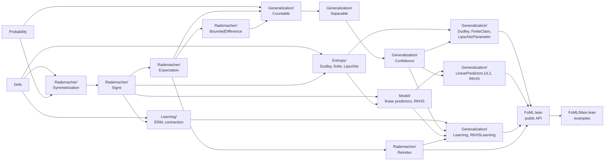

# Lean Formalization of Generalization Bounds via Rademacher Complexity and Dudley's Entropy Integral

[](https://arxiv.org/abs/2503.19605)

## Abstract

Understanding and certifying the generalization performance of machine
learning algorithms—obtaining theoretical estimates of test error from a
finite training sample—is a central theme of statistical learning theory.
Among the many complexity measures used to derive such guarantees,
Rademacher complexity yields sharp, data-dependent bounds that apply well
beyond classical $0$-$1$ classification.

This project formalizes generalization bounds based on Rademacher complexity
in Lean 4, using the measure-theoretic probability theory in Mathlib. The
development connects empirical and expected Rademacher complexity,
symmetrization, bounded differences, and McDiarmid's inequality to
high-probability uniform-deviation bounds. A reusable reduction from separable
hypothesis classes to countable dense subclasses handles measurability of
suprema. The resulting bridge is instantiated for $\ell_2$- and
$\ell_1/\ell_\infty$-bounded linear predictors, feature-map RKHS predictors,
Dudley's entropy integral, finite classes, and one-dimensional Lipschitz
parameter families. The library also connects these bounds to approximate
empirical risk minimization, Lipschitz contraction, and excess-risk bounds.

## Highlights

- Expected and observed-sample Rademacher generalization bounds for countable
  and separable hypothesis classes.
- Deterministic and sample-dependent confidence bounds for
  $\ell_2$- and $\ell_1/\ell_\infty$-regularized linear predictors.
- RKHS bounds in kernel-trace and uniform kernel-diagonal forms.
- Dudley entropy-integral bounds, including explicit endpoints for finite
  classes and Lipschitz parameter families.
- Oracle inequalities and high-probability excess-risk bounds for exact and
  approximate empirical risk minimizers.
- Reindexing lemmas and finite-class contraction inequalities for reusable
  model-class arguments.

## How to run

```bash
git clone https://github.com/auto-res/lean-rademacher.git
cd lean-rademacher
lake exe cache get
lake build
```

To browse the checked examples interactively, open the repository in VS Code
with the Lean extension and inspect [`FoML/Main.lean`](FoML/Main.lean).

## Contents (selected)

[`FoML.lean`](FoML.lean) is the public library entry point.
[`FoML/Main.lean`](FoML/Main.lean) imports it and presents end-to-end examples.
The following diagram shows the selected dependency paths used by those
examples. Arrows point from a dependency to the module that uses it;
`ForMathlib/` support modules and most Mathlib imports are omitted.



Selected modules:

| Area | Modules | Role |
| --- | --- | --- |
| Core definitions | [`FoML/Defs.lean`](FoML/Defs.lean) | Empirical and expected Rademacher complexity and uniform deviation |
| Rademacher theory | [`FoML/Rademacher/`](FoML/Rademacher/) | Symmetrization, sign averages, expectations, bounded differences, and reindexing |
| Generalization bridge | [`FoML/Generalization/Countable.lean`](FoML/Generalization/Countable.lean), [`Separable.lean`](FoML/Generalization/Separable.lean), [`Confidence.lean`](FoML/Generalization/Confidence.lean) | Countable-to-separable reduction and confidence-parameter bounds |
| Entropy | [`FoML/Entropy/`](FoML/Entropy/) | Covering numbers, empirical pseudometrics, Massart's lemma, and Dudley chaining |
| Models | [`FoML/Model/`](FoML/Model/) | Linear, Hilbert-space, and feature-map RKHS predictors |
| Learning | [`FoML/Learning/`](FoML/Learning/) | Population and empirical risk, approximate ERM, oracle inequalities, and contraction |
| Applications | [`FoML/Generalization/`](FoML/Generalization/) | End-to-end linear, RKHS, Dudley, finite-class, Lipschitz-family, and excess-risk bounds |

Selected declarations:

- `empiricalRademacherComplexity` and `rademacherComplexity` define the
  empirical and expected complexities.
- `uniform_deviation_tail_bound_separable_of_empirical_le_delta` turns a
  fixed-sample empirical-complexity bound into a separable-class confidence
  bound.
- `uniform_deviation_tail_bound_separable_of_empirical_complexity` retains the
  empirical Rademacher complexity of the observed sample in the threshold.
- `linear_predictor_l2_uniform_deviation_tail_bound_delta` and
  `linear_predictor_l1_uniform_deviation_tail_bound_delta` give deterministic
  end-to-end bounds for the two linear classes; the corresponding
  `..._of_sample_delta` declarations retain observed sample radii.
- `rkhs_uniformDeviation_tail_bound_kernelTrace_delta` gives the
  sample-dependent RKHS kernel-trace bound, while
  `rkhs_uniformDeviation_tail_bound_delta` uses a uniform diagonal estimate.
- `dudley_entropy_integral_bound_abs` bounds absolute empirical Rademacher
  complexity, and
  `uniform_deviation_tail_bound_separable_of_dudley_delta` connects the
  observed entropy integral to a confidence bound.
- `uniform_deviation_tail_bound_finite_of_dudley_quarter_delta` and
  `uniform_deviation_tail_bound_lipschitzParameter_dudley_delta` are explicit
  Dudley endpoints without an unevaluated covering number.
- `approxERM_excessRisk_tail_bound_separable_of_sample_empirical_le_delta`
  converts a sample-dependent complexity estimate into an approximate-ERM
  excess-risk bound.
- `finite_rkhs_approxERM_excessRisk_tail_bound_delta` combines RKHS
  kernel-trace control, Lipschitz contraction, and approximate ERM.
- `empiricalRademacherComplexity_reindex_le` proves monotonicity under
  reindexing of a hypothesis class.

## Future plans

Contributions are welcome; discussion takes place on
[Discord](https://discord.gg/wdTpRCR8fW).

- Construct a canonical RKHS and feature map from an arbitrary
  positive-semidefinite kernel. The current RKHS results start from a supplied
  feature map into a Hilbert space.
- Extend the present finite-hypothesis contraction theorem and the resulting
  RKHS loss-class excess-risk bound to broader hypothesis classes.
- Add explicit covering-number estimates for further classes, such as
  multidimensional Lipschitz functions and neural networks with bounded
  weights.
- Refine constants and expand the reusable probability-inequality layer.

## Contributors

Kei Tsukamoto, Kazumi Kasaura, Naoto Onda, Yuma Mizuno, Sho Sonoda
