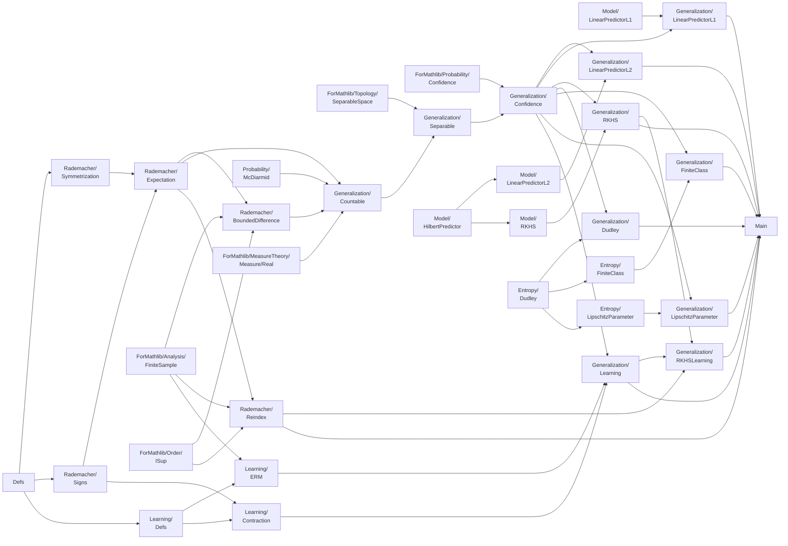

# `lean-rademacher` の実装概要

- 最終確認日: 2026-07-24
- 基準ブランチ: `ss`（Phase 10 完了時点）

## 0. 対象と現在の到達点

この文書は、統計的学習理論における Rademacher 複雑度と汎化評価を Lean 4 で形式化する `lean-rademacher` リポジトリの現行実装を整理したものである。抽象的な汎化定理は [`FoML/Generalization/Countable.lean`](../FoML/Generalization/Countable.lean)、[`FoML/Generalization/Separable.lean`](../FoML/Generalization/Separable.lean)、[`FoML/Generalization/Confidence.lean`](../FoML/Generalization/Confidence.lean) に分割されている。[`FoML/Main.lean`](../FoML/Main.lean) は主要な利用例を繰り返す入口、[`FoML.lean`](../FoML.lean) はライブラリ全体の入口である。

現在の実装は、次の九つの経路を一つの公開 API として接続している。

1. 一様偏差の期待値を symmetrization により期待 Rademacher 複雑度で評価する。
2. 一様偏差の有界差分性と McDiarmid の不等式から高確率汎化評価を得る。
3. 固定標本上の経験 Rademacher 複雑度の一様上界を、期待量と高確率汎化評価へ移す。
4. 経験 Rademacher 複雑度自身の下側集中を使い、観測標本の経験量を閾値に残した高確率汎化評価を得る。
5. 標本ごとの経験評価 $\widehat{\mathfrak R}_n(f;S)\le C(S)$ を、$C(S)$ がランダムな閾値に残る高確率汎化評価へ移す。
6. 線形予測器または Dudley entropy integral による経験複雑度の評価を上記の接続定理へ投入し、信頼度 $0<\delta\le1$ を直接受け取る E2E 評価を得る。
7. 一様偏差評価を ERM の決定論的 oracle inequality と合成し、期待または経験
   Rademacher 複雑度から余剰誤差の高確率評価を得る。
8. 有限クラスまたは一次元 Lipschitz パラメータ族の被覆数を具体的に評価し、
   Dudley の entropy integral から被覆数を含まない高確率汎化評価を得る。
9. Hilbert 空間の符号和評価を特徴写像 kernel の trace 評価へ書き換え、
   RKHS 予測器の期待量・高確率汎化評価、さらに有限モデルの余剰誤差評価を得る。

とくに、以前分離していた次の事項は接続済みである。

- $\ell_2$ および $\ell_1/\ell_\infty$ 線形予測器について、経験評価から期待 Rademacher 複雑度、期待一様偏差、高確率汎化評価までの専用定理がある。
- 両線形クラスについて、一様半径による決定論的複雑度項だけでなく、観測標本の二乗ノルムまたは座標ごとの二乗和を残す標本依存 E2E 評価がある。
- Dudley の片側経験複雑度の評価を、符号対称化により絶対値付き経験複雑度へ変換し、標本一様な entropy 評価から期待量と高確率汎化評価を得られる。
- Dudley の右辺を標本一様な定数へ置き換えず、観測標本上の entropy integral をランダムな閾値に残す高確率汎化評価があり、`ε` 形式と `δ` 形式の両方を公開する。
- 厳密 ERM と $\eta$-近似 ERM の両方について、標本依存学習則を受け取る
  余剰誤差評価があり、学習則の可測性や `argmin` の存在を不要に仮定しない。
- 有限仮説型について Lipschitz contraction を証明し、片側経験 Rademacher
  複雑度では定数 $L$、絶対値付き定義では定数 $2L$ となることを明示している。
- 有限クラスでは $N(F^\pm,\varepsilon)\le2|H|$、一次元 Lipschitz
  パラメータ族では
  $N(F,\varepsilon)\le\lceil2WL/\varepsilon\rceil+1$ を証明し、両者を
  proof term の現れない Dudley E2E 評価へ接続している。
- 特徴写像 $\Phi$ が誘導する kernel について Mohri, Theorem 6.12 の
  kernel trace 版と $r\Lambda/\sqrt n$ 版があり、標本依存・決定論的な
  二種類の信頼度形式まで接続している。
- 有限個の RKHS 重みについては、定数 $2L$ の絶対値付き contraction と
  近似 ERM oracle inequality を合成した余剰誤差 E2E 評価がある。

概念上の依存関係は次のようにまとめられる。



ソースファイルは依存層ごとに次のディレクトリへ分けている。

```text
FoML/
├── Defs.lean
├── Main.lean
├── Probability/      # 積測度、期待値補題、Hoeffding、McDiarmid
├── Rademacher/       # 符号、対称化、期待量、有界差分、reindex
├── Entropy/          # 被覆数、経験擬距離、Massart、Dudley
├── Model/            # 個別の仮説クラス
├── Learning/         # risk、ERM、oracle inequality、contraction
├── Generalization/   # 可算・可分 bridge、信頼度形式、個別 E2E
└── ForMathlib/       # 統計的学習理論に依存しない補助補題
```

直下に残す Lean ファイルは中心定義の `Defs.lean` と公開例の `Main.lean`
だけである。ライブラリ全体の入口は従来通りリポジトリ直下の `FoML.lean` である。

## 1. 共通の設定と中心定義

### 1.1 確率空間、関数クラス、標本

基本的な対象は以下である。

- $(\Omega,\mu)$: 基礎確率空間。主な汎化定理では `[IsProbabilityMeasure μ]` を仮定する。
- $X:\Omega\to\mathcal X$: 一つのデータ点を表す確率変数。
- $\iota$: 仮説またはパラメータの添字型。
- $f:\iota\to\mathcal X\to\mathbb R$: 関数クラス $\{f_i\}_{i\in\iota}$。
- $S:\operatorname{Fin}n\to\mathcal X$: サイズ $n$ の固定標本。
- $\omega:\operatorname{Fin}n\to\Omega$: 積空間上の点。
- $X\circ\omega:\operatorname{Fin}n\to\mathcal X$: ランダム標本。
- $\mu^n:=\operatorname{Measure.pi}(\lambda\_\Rightarrow\mu)$: i.i.d. 標本を生成する有限積測度。

同一分布の標本を、独立な確率変数を個別に列挙する代わりに、一つの写像 $X$ と有限積測度の座標射影で表している。

### 1.2 Rademacher 符号

[`FoML/Defs.lean`](../FoML/Defs.lean) の

```lean
def Signs (n : ℕ) : Type := Fin n → ({-1, 1} : Finset ℤ)
```

は $n$ 個の Rademacher 符号を有限型として表す。`Signs.card` により

$$
|\operatorname{Signs}(n)|=2^n
$$

が示される。経験 Rademacher 複雑度は、この有限型上の明示的な平均として定義される。

### 1.3 共通 Rademacher functional

絶対値付き版と片側版に共通する符号和は、型だけでなく項まで次のように定義される。

```lean
def normalizedRademacherSum
    (n : ℕ) (F : ι → 𝒳 → ℝ) (S : Fin n → 𝒳)
    (σ : Signs n) (h : ι) : ℝ :=
  (n : ℝ)⁻¹ * ∑ k : Fin n, (σ k : ℝ) * F h (S k)

def empiricalRademacherFunctional
    (n : ℕ) (φ : ℝ → ℝ)
    (F : ι → 𝒳 → ℝ) (S : Fin n → 𝒳) : ℝ :=
  (Fintype.card (Signs n) : ℝ)⁻¹ *
    ∑ σ : Signs n, ⨆ h,
      φ (normalizedRademacherSum n F S σ h)
```

したがって、絶対値付き版は $\varphi=\lvert\cdot\rvert$、片側版は
$\varphi=\operatorname{id}$ の特殊化である。この対応は
`empiricalRademacherFunctional_abs` と
`empiricalRademacherFunctional_id` で明示される。

`Rademacher/Signs.lean` には PMF 版も

```lean
noncomputable def empiricalRademacherFunctional_pmf
    (φ : ℝ → ℝ) (F : ι → 𝒳 → ℝ) (S : Fin n → 𝒳) : ℝ :=
  ∫ σ, ⨆ h, φ (normalizedRademacherSum n F S σ h)
    ∂(signVecPMF n).toMeasure
```

と定義される。有限符号平均とこの積分の一致は
`empiricalRademacherFunctional_eq_pmf` で一度だけ示し、従来の絶対値付き・
片側 PMF bridge はその二つの系として保っている。

### 1.4 絶対値付き経験 Rademacher 複雑度

```lean
def empiricalRademacherComplexity
    (n : ℕ) (f : ι → 𝒳 → ℝ) (S : Fin n → 𝒳) : ℝ :=
  (Fintype.card (Signs n) : ℝ)⁻¹ *
    ∑ σ : Signs n, ⨆ i,
      |(n : ℝ)⁻¹ * ∑ k : Fin n, (σ k : ℝ) * f i (S k)|
```

は

$$
\widehat{\mathfrak R}_n(f;S)
=\frac1{2^n}\sum_{\sigma\in\{\pm1\}^n}
 \sup_{i\in\iota}
 \left|\frac1n\sum_{k=1}^n\sigma_k f_i(S_k)\right|
$$

を表す。汎化評価と線形予測器の最終的な経験評価では、この絶対値付き定義を使う。

### 1.5 片側経験 Rademacher 複雑度

```lean
def empiricalRademacherComplexity_without_abs
    (n : ℕ) (f : ι → 𝒳 → ℝ) (S : Fin n → 𝒳) : ℝ :=
  (Fintype.card (Signs n) : ℝ)⁻¹ *
    ∑ σ : Signs n, ⨆ i,
      (n : ℝ)⁻¹ * ∑ k : Fin n, (σ k : ℝ) * f i (S k)
```

は絶対値を外した

$$
\widehat{\mathfrak R}^{\mathrm{noabs}}_n(f;S)
=\frac1{2^n}\sum_{\sigma\in\{\pm1\}^n}
 \sup_{i\in\iota}
 \frac1n\sum_{k=1}^n\sigma_k f_i(S_k)
$$

を表す。Massart の補題と Dudley chaining の基本形は、この片側版を評価する。

一様有界性の下では

```lean
empiricalRademacherComplexity_without_abs_le_empiricalRademacherComplexity
```

により

$$
\widehat{\mathfrak R}^{\mathrm{noabs}}_n(f;S)
\le
\widehat{\mathfrak R}_n(f;S)
$$

が示される。この不等式だけでは片側版の上界を絶対値付き版へ移せないため、Dudley との接続には後述の符号対称化を使う。

### 1.6 期待 Rademacher 複雑度

```lean
def rademacherComplexity
    (n : ℕ) (f : ι → 𝒳 → ℝ)
    (μ : Measure Ω) (X : Ω → 𝒳) : ℝ :=
  μⁿ[fun ω : Fin n → Ω ↦
    empiricalRademacherComplexity n f (X ∘ ω)]
```

は、経験量をランダム標本について積分した

$$
\mathfrak R_n(f;\mu,X)
=\mathbb E_{\omega\sim\mu^n}
 \left[\widehat{\mathfrak R}_n(f;X\circ\omega)\right]
$$

を表す。

### 1.7 一様偏差

```lean
def uniformDeviation
    (n : ℕ) (f : ι → 𝒳 → ℝ)
    (μ : Measure Ω) (X : Ω → 𝒳)
    (S : Fin n → 𝒳) : ℝ :=
  ⨆ i, |(n : ℝ)⁻¹ * ∑ k : Fin n, f i (S k) -
    μ[fun ω' ↦ f i (X ω')]|
```

は

$$
\operatorname{UD}_n(f;\mu,X;S)
=\sup_{i\in\iota}
 \left|
   \frac1n\sum_{k=1}^n f_i(S_k)
   -\mathbb E_\mu[f_i(X)]
 \right|
$$

を表す。標本を見た後に仮説を選ぶ場合でも、関数クラス全体の汎化ギャップを同時に評価する量である。

## 2. 確率論的な共通基盤

### 2.1 積測度の座標分布と独立性

[`FoML/Probability/MeasurePi.lean`](../FoML/Probability/MeasurePi.lean) は有限積測度について次を提供する。

| 宣言 | 内容 |
|---|---|
| `pi_map_eval` | $\mu^n$ を一つの座標評価写像で push-forward すると $\mu$ になる。 |
| `pi_eval_iIndepFun` | $\mu^n$ 上の座標評価関数族が独立である。 |
| `pi_comp_eval_iIndepFun` | 各座標に同じ可測写像 $X$ を合成しても独立性が保たれる。 |

これらは積測度版 McDiarmid の不等式と、標本平均・母平均の積分操作を支える。

### 2.2 符号反転、直交性、PMF 表現

[`FoML/Rademacher/Signs.lean`](../FoML/Rademacher/Signs.lean) の主要な基盤は以下である。

| 宣言 | 内容 |
|---|---|
| `rademacher_flip` | 一座標の符号を反転する involution。 |
| `sign_sum_eq_zero` | 各座標について符号の総和が $0$。 |
| `rademacher_orthogonality` | $k\ne l$ なら $\sum_\sigma\sigma_k\sigma_l=0$。 |
| `signVecPMF` | `Signs n` 上の一様確率質量関数。 |
| `empiricalRademacherComplexity_pmf` | 絶対値付き経験量の PMF 積分版。 |
| `empiricalRademacherComplexity_pmf_without_abs` | 片側経験量の PMF 積分版。 |
| `..._eq_..._pmf` | 有限平均による定義と PMF 積分版の同一性。 |

有限和で定義した経験量を、測度論的な maximal inequality や Massart の補題へ渡すための接続層である。

このファイルには、現在さらに次の一般補題がある。

| 宣言 | 内容 |
|---|---|
| `empiricalRademacherComplexity_nonneg` | 経験 Rademacher 複雑度の非負性。 |
| `empiricalRademacherComplexity_comp` | 関数クラスの定義域写像と標本写像の整合性。 |
| `signSymmetrization` | 各関数とその負号を含むクラス。 |
| `IsNegClosed` | 関数クラスが点ごとの負号で閉じていること。 |
| `empiricalRademacherComplexity_eq_without_abs_signSymmetrization` | 絶対値付き経験量と符号対称化クラスの片側経験量の等式。 |
| `empiricalRademacherComplexity_eq_without_abs_of_neg_closed` | 負号で閉じたクラスにおける絶対値付き版と片側版の等式。 |

### 2.3 指数傾斜と Hoeffding の補題

[`FoML/Probability/Expectation.lean`](../FoML/Probability/Expectation.lean) は、一様なノルム上界から期待値のノルム上界を得る補題を提供する。

[`FoML/ForMathlib/Probability/Moments.lean`](../FoML/ForMathlib/Probability/Moments.lean) は Mathlib の補完層として、次を形式化する。

- 有界確率変数に対する指数関数の可積分性。
- exponential tilting 後の分散上界 `tilt_var_bound`。
- MGF と tilted expectation の微分公式。
- cumulant generating function の一階・二階微分。

これを用いて [`FoML/Probability/Hoeffding.lean`](../FoML/Probability/Hoeffding.lean) は `ProbabilityTheory.hoeffding` を示す。$\mathbb E X=0$ かつ $a\le X\le b$ がほとんど至る所で成立するとき、

$$
\operatorname{mgf}_X(t)
\le
\exp\!\left(\frac{t^2(b-a)^2}{8}\right)
$$

が全ての $t\in\mathbb R$ について成立する。

### 2.4 McDiarmid の不等式

[`FoML/Probability/McDiarmid.lean`](../FoML/Probability/McDiarmid.lean) は、独立性と反復積分から McDiarmid の不等式を構成する。

独立な確率変数族 $X_i$ と有界差分条件

$$
|g(x)-g(x^{(i\leftarrow x')})|\le c_i
$$

の下で、`mcdiarmid_inequality_pos` は $t\sum_i c_i^2\le1$ と $\varepsilon\ge0$ から

$$
\Pr\{g(X)-\mathbb Eg(X)\ge\varepsilon\}
\le
\exp(-2\varepsilon^2t)
$$

を与える。

| 宣言 | 役割 |
|---|---|
| `mcdiarmid_inequality_pos` | 一般の独立な有限族に対する上側 tail。 |
| `mcdiarmid_inequality_neg` | 下側 tail。 |
| `mcdiarmid_inequality_pos'` | 同じ $X$ を積測度の各座標に適用する i.i.d. 版。 |
| `mcdiarmid_inequality_neg'` | 下側 tail の i.i.d. 積測度版。 |
| `mcdiarmid_inequality_pos_iid_of_const` | 全座標の感度が同じ $c$ である i.i.d. 上側 tail。 |
| `mcdiarmid_inequality_neg_iid_of_const` | 全座標の感度が同じ $c$ である i.i.d. 下側 tail。 |
| `bounded_difference_iff` | 絶対値付き感度条件と片側条件の同値。 |

定数感度版は $t|\iota|c^2\le1$ を直接受け取る。汎化評価では
$c=2b/n$ を代入するため、各証明で定数関数と
$\sum_i c^2=|\iota|c^2$ を再展開する必要がない。

## 3. Rademacher 複雑度による汎化評価

### 3.1 Symmetrization

[`FoML/Rademacher/Symmetrization.lean`](../FoML/Rademacher/Symmetrization.lean) の中心は

```lean
symmetrization_equation
abs_symmetrization_equation
```

である。`abs_symmetrization_equation` は ghost sample $(X'_k)$ を導入した差

$$
\sup_i
\left|
  \sum_k(f_i(X_k)-f_i(X'_k))
\right|
$$

の期待値を、Rademacher 符号を挿入した

$$
2^{-n}\sum_\sigma
\sup_i
\left|
  \sum_k\sigma_k(f_i(X_k)-f_i(X'_k))
\right|
$$

の期待値へ変換する。可算な添字型、非空性、可測性、一様有界性が明示的な仮定として現れる。

### 3.2 期待一様偏差

[`FoML/Rademacher/Expectation.lean`](../FoML/Rademacher/Expectation.lean) の

```lean
expectation_le_rademacher
```

は、非正規化形

$$
\mathbb E\left[
 \sup_i
 \left|
   \sum_{k=1}^n f_i(X_k)
   -n\mathbb E f_i(X)
 \right|
\right]
\le
2n\,\mathfrak R_n(f;\mu,X)
$$

を示す。

[`FoML/Generalization/Countable.lean`](../FoML/Generalization/Countable.lean) の公開定理

```lean
uniform_deviation_expectation_le_two_smul_rademacher_complexity
```

は $n>0$ の下でこれを正規化し、

$$
\mathbb E_{S\sim\mu^n}
 [\operatorname{UD}_n(f;\mu,X;S)]
\le
2\mathfrak R_n(f;\mu,X)
$$

を与える。

### 3.3 一様偏差の有界差分性

[`FoML/Rademacher/BoundedDifference.lean`](../FoML/Rademacher/BoundedDifference.lean) の

```lean
uniformDeviation_bounded_difference
```

は $|f_i(x)|\le b$ の下で、一標本だけを置換したとき

$$
|\operatorname{UD}_n(S)
 -\operatorname{UD}_n(S^{(k\leftarrow x')})|
\le
\frac{2b}{n}
$$

を示す。

同じファイルの `uniformDeviation_measurable` は、可算クラスかつ各 $f_i$ が可測なら、標本を一様偏差へ送る写像が可測であることを示す。

同じく

```lean
empiricalRademacherComplexity_bounded_difference
```

は、絶対値付き経験 Rademacher 複雑度について

$$
\left|
  \widehat{\mathfrak R}_n(f;S)
  -
  \widehat{\mathfrak R}_n(f;S^{(k\leftarrow x')})
\right|
\le
\frac{2b}{n}
$$

を示す。各 Rademacher 符号について正規化符号和の差を評価し、その後で関数クラス上の上限と有限符号平均へ評価を移している。

この二つの証明で共通する部分は `ForMathlib` へ分離されている。

- `abs_normalized_fin_sum_le`: 一様有界な正規化有限和の評価。
- `abs_normalized_fin_sum_update_sub_le`: 一座標置換による正規化有限和の変化。
- `abs_ciSup_sub_ciSup_le`: 点ごとの距離評価から二つの実数値 `iSup` の距離評価への移送。

これにより、統計的な証明側には「各仮説の変化を評価し、その評価を上限と符号平均へ
移す」という構造だけが残る。

### 3.4 可算クラスの tail 評価

`uniform_deviation_mcdiarmid_tail` は、$t b^2\le1/2$ と $\varepsilon\ge0$ の下で

$$
\Pr\{
  \operatorname{UD}_n-\mathbb E\operatorname{UD}_n
  \ge\varepsilon
\}
\le
\exp(-\varepsilon^2tn)
$$

を与える。

期待値評価と合成した定理は次の二つである。

```lean
uniform_deviation_tail_bound_countable
uniform_deviation_tail_bound_countable_of_pos
```

$b>0$ の最適化形は

$$
\Pr\{
  \operatorname{UD}_n
  \ge 2\mathfrak R_n+\varepsilon
\}
\le
\exp\!\left(-\frac{n\varepsilon^2}{2b^2}\right)
$$

を示す。Lean の命題では、悪い事象の測度を `ENNReal.toReal` により実数へ移して評価している。

### 3.5 経験 Rademacher 複雑度を使う標本依存 tail

`empiricalRademacherComplexity_lower_tail_countable` とその最適化形

```lean
empiricalRademacherComplexity_lower_tail_countable_of_pos
```

は、経験 Rademacher 複雑度の有界差分性と `mcdiarmid_inequality_neg'` を合成する。$b>0$ のとき

$$
\Pr\left\{
  \widehat{\mathfrak R}_n(f;S)
  -
  \mathfrak R_n(f;\mu,X)
  \le-\varepsilon
\right\}
\le
\exp\!\left(-\frac{n\varepsilon^2}{2b^2}\right)
$$

を得る。

これと 3.4 の期待 Rademacher 複雑度を使う tail を union bound で合成した定理が

```lean
uniform_deviation_tail_bound_countable_of_empirical_complexity
```

である。結論は

$$
\Pr\left\{
  \operatorname{UD}_n(f;S)
  \ge
  2\widehat{\mathfrak R}_n(f;S)+3\varepsilon
\right\}
\le
2\exp\!\left(-\frac{n\varepsilon^2}{2b^2}\right).
$$

右辺の閾値は観測標本 $S$ に依存し、全標本に共通する経験複雑度上界 $C$ を必要としない。

各標本で計算できる上界 $C(S)$ があり

$$
\widehat{\mathfrak R}_n(f;S)\le C(S)
$$

なら、`uniform_deviation_tail_bound_countable_of_sample_empirical_le` により経験複雑度そのものを $C(S)$ で置き換えられる。

### 3.6 可分クラスへの拡張

[`FoML/ForMathlib/Topology/SeparableSpace.lean`](../FoML/ForMathlib/Topology/SeparableSpace.lean) の

```lean
separableSpaceSup_eq_real
```

は、可分位相空間上の連続関数について

$$
\sup_{i\in\iota}g(i)
=
\sup_{m\in\mathbb N}
g(\operatorname{denseSeq}(\iota,m))
$$

を示す。

同じファイルでは、稠密可算部分クラスを表す項を次のように定義する。

```lean
noncomputable abbrev denseRestriction
    {H : Type u} {α : Type w}
    [TopologicalSpace H] [SeparableSpace H] [Nonempty H]
    (F : H → α) : ℕ → α :=
  F ∘ denseSeq H
```

[`FoML/Generalization/Separable.lean`](../FoML/Generalization/Separable.lean) は、この項へ制限しても以下の量が変わらないことを示す。

| 宣言 | 対象 |
|---|---|
| `empiricalRademacherComplexity_denseRestriction` | 固定標本上の経験 Rademacher 複雑度。 |
| `rademacherComplexity_denseRestriction` | 期待 Rademacher 複雑度。 |
| `uniformDeviation_denseRestriction` | 一様偏差。 |

旧名 `empiricalRademacherComplexity_eq`、`RademacherComplexity_eq`、
`uniformDeviation_eq` は互換用の deprecated alias として残している。新しい名前は
Mathlib の lowerCamelCase convention に合わせ、どの変換に関する等式かを明示する。

可分クラス向けの主な tail 定理は

```lean
uniform_deviation_tail_bound_separable
uniform_deviation_tail_bound_separable_of_pos
uniform_deviation_tail_bound_separable_of_empirical_complexity
uniform_deviation_tail_bound_separable_of_sample_empirical_le
uniform_deviation_tail_bound_separable_of_sample_empirical_le_delta
```

である。可算性の代わりに、添字空間の可分性、点ごとのパラメータ連続性、一様有界性などを仮定する。一様偏差の等式では、母平均のパラメータ連続性を得るため `FirstCountableTopology` も用いる。

## 4. 固定標本評価から期待量・汎化評価への接続

### 4.1 経験複雑度の可測性と可積分性

[`FoML/Rademacher/Expectation.lean`](../FoML/Rademacher/Expectation.lean) には次が実装されている。

| 宣言 | 内容 |
|---|---|
| `empiricalRademacherComplexity_le_of_bounded` | $|f_i(x)|\le b$ なら経験複雑度も $b$ 以下。 |
| `measurable_empiricalRademacherComplexity_comp` | ランダム標本上の経験複雑度の可測性。 |
| `integrable_empiricalRademacherComplexity_comp` | 一様有界な可算クラスに対する可積分性。 |
| `rademacherComplexity_le_of_ae_empirical_le` | ほとんど至る所の経験評価を期待量へ移す。 |
| `rademacherComplexity_le_of_empirical_le` | 全標本での経験評価を期待量へ移す。 |
| `rademacherComplexity_le_of_empirical_le_countable` | 可算・可測・一様有界クラス向けの公開しやすい形。 |

基本的な接続は

$$
\left(
  \forall S,\quad
  \widehat{\mathfrak R}_n(f;S)\le C
\right)
\Longrightarrow
\mathfrak R_n(f;\mu,X)\le C
$$

である。

### 4.2 決定論的閾値を使う公開定理

`FoML/Generalization/Countable.lean` と `FoML/Generalization/Separable.lean` は、固定標本で一様な評価を期待一様偏差と tail 評価へ直接渡す。

| 対象 | 可算クラス | 可分クラス |
|---|---|---|
| 期待 Rademacher 複雑度 | `rademacherComplexity_le_of_empirical_le_countable` | `rademacherComplexity_le_of_empirical_le_separable` |
| 期待一様偏差 | `uniform_deviation_expectation_le_of_empirical_le_countable` | `uniform_deviation_expectation_le_of_empirical_le_separable` |
| 高確率一様偏差 | `uniform_deviation_tail_bound_countable_of_empirical_le` | `uniform_deviation_tail_bound_separable_of_empirical_le` |

経験評価から期待量への変換と、期待量の上界を確率しきい値へ代入する変換は分離されている。後者は

```lean
uniform_deviation_expectation_le_of_rademacher_le
uniform_deviation_tail_bound_countable_of_rademacher_le
uniform_deviation_tail_bound_separable_of_rademacher_le
```

である。したがって、経験 Rademacher 複雑度以外の方法で
$\mathfrak R_n(f;\mu,X)\le C$ を得た場合も同じ tail bridge を再利用できる。
しきい値を大きくしたときの事象包含と、中心化 tail から非中心化 tail への変換は
[`FoML/ForMathlib/MeasureTheory/Measure/Real.lean`](../FoML/ForMathlib/MeasureTheory/Measure/Real.lean)
の `MeasureTheory.measureReal_superlevel_mono` および
`MeasureTheory.measureReal_superlevel_le_of_centered` に集約されている。

可分クラス版の最適化された tail 定理は

$$
\Pr\{
  \operatorname{UD}_n
  \ge 2C+\varepsilon
\}
\le
\exp\!\left(-\frac{n\varepsilon^2}{2b^2}\right)
$$

という形を持つ。ここで $C$ は経験 Rademacher 複雑度の全標本一様上界、$b$ は関数値の一様上界であり、役割が異なる。

[`FoML/Generalization/Confidence.lean`](../FoML/Generalization/Confidence.lean) の
`uniform_deviation_tail_bound_separable_of_empirical_le_delta` は信頼度を直接受け取り、$n>0$, $b>0$, $0<\delta\le1$ の下で

$$
\Pr\left\{
  \operatorname{UD}_n
  \ge
  2C+b\sqrt{\frac{2\log(1/\delta)}{n}}
\right\}
\le\delta
$$

を与える。

信頼半径は項として

```lean
noncomputable def confidenceRadius (κ b δ : ℝ) (n : ℕ) : ℝ :=
  b * Real.sqrt (2 * Real.log (κ / δ) / n)

noncomputable def deterministicConfidenceRadius
    (b δ : ℝ) (n : ℕ) : ℝ :=
  confidenceRadius 1 b δ n

noncomputable def sampleConfidenceRadius
    (b δ : ℝ) (n : ℕ) : ℝ :=
  confidenceRadius 2 b δ n
```

と定義される。指数関数、対数、平方根の計算は
`mul_exp_neg_confidenceRadius_sq` 一つにまとめ、決定論的経路の
$\kappa=1$ と union bound を使う標本依存経路の $\kappa=2$ を系として導く。

### 4.3 標本依存閾値を使う公開定理

全標本一様な定数 $C$ を経由しない経路も実装されている。

| 対象 | 宣言 |
|---|---|
| 経験複雑度の下側集中 | `empiricalRademacherComplexity_lower_tail_countable`, `empiricalRademacherComplexity_lower_tail_countable_of_pos` |
| 可算クラスの標本依存 tail | `uniform_deviation_tail_bound_countable_of_empirical_complexity` |
| 可算クラスの標本依存上界 bridge | `uniform_deviation_tail_bound_countable_of_sample_empirical_le` |
| 可分クラスの標本依存 tail | `uniform_deviation_tail_bound_separable_of_empirical_complexity` |
| 可分クラスの標本依存上界 bridge | `uniform_deviation_tail_bound_separable_of_sample_empirical_le` |
| 可分クラスの標本依存上界 bridge、信頼度形式 | `uniform_deviation_tail_bound_separable_of_sample_empirical_le_delta` |

可分クラス版も

$$
\Pr\left\{
  \operatorname{UD}_n(f;S)
  \ge
  2\widehat{\mathfrak R}_n(f;S)+3\varepsilon
\right\}
\le
2\exp\!\left(-\frac{n\varepsilon^2}{2b^2}\right)
$$

を示す。稠密可算部分クラスへの還元により、経験 Rademacher 複雑度と一様偏差の両方を保存してから可算クラス版を適用する。

より一般に、各標本で $\widehat{\mathfrak R}_n(f;S)\le C(S)$ が成立すれば

$$
\Pr\left\{
  \operatorname{UD}_n(f;S)
  \ge
  2C(S)+3\varepsilon
\right\}
\le
2\exp\!\left(-\frac{n\varepsilon^2}{2b^2}\right).
$$

信頼度形式では

$$
\widetilde\varepsilon_\delta
=
b\sqrt{\frac{2\log(2/\delta)}{n}}
$$

を用いて

$$
\Pr\left\{
  \operatorname{UD}_n(f;S)
  \ge
  2C(S)+3\widetilde\varepsilon_\delta
\right\}
\le\delta
$$

を得る。これは線形予測器の標本幾何による評価と Dudley entropy integral に共通する接続である。

## 5. Hilbert 空間と $\ell_2$ 制約付き線形予測器

### 5.1 関数クラス

[`FoML/Model/LinearPredictorL2.lean`](../FoML/Model/LinearPredictorL2.lean) の

```lean
noncomputable def linearPredictorL2
    {d : ℕ} {W X : ℝ}
    (w : Metric.closedBall (0 : EuclideanSpace ℝ (Fin d)) W)
    (x : Metric.closedBall (0 : EuclideanSpace ℝ (Fin d)) X) : ℝ :=
  ⟪(w : EuclideanSpace ℝ (Fin d)),
    (x : EuclideanSpace ℝ (Fin d))⟫
```

は

$$
f_w(x)=\langle w,x\rangle
$$

を、重みと入力をそれぞれ

```lean
Metric.closedBall 0 W
Metric.closedBall 0 X
```

に制限した関数として定義する。

`continuous_linearPredictorL2_weight` と
`continuous_linearPredictorL2_input` は、パラメータ方向と入力方向の連続性を与える。`abs_linearPredictorL2_le` は

$$
|f_w(x)|\le XW
$$

を示し、汎化定理の有界性仮定を供給する。

### 5.2 経験 Rademacher 複雑度

標本依存の経験評価

```lean
linear_predictor_l2_empirical_bound_of_sample
```

は

$$
\widehat{\mathfrak R}_n(\mathcal F_{2,W};S)
\le
\frac{W}{n}
\sqrt{\sum_{k=1}^n\|S_k\|_2^2}
$$

を示す。一様半径による評価

```lean
linear_predictor_l2_empirical_bound
```

は $\|S_k\|_2\le X$ を各項に使った系であり、任意の固定標本 $S$ について

$$
\widehat{\mathfrak R}_n(\mathcal F_{2};S)
\le
\frac{XW}{\sqrt n}
$$

を示す。公開定理は
[`FoML/Model/HilbertPredictor.lean`](../FoML/Model/HilbertPredictor.lean) の
次元に依存しない定理の有限次元系として実装されている。一般 Hilbert 空間で
符号付き和のノルム二乗を展開し、`rademacher_orthogonality` で非対角交差項を
消去し、Cauchy--Schwarz で符号平均を二乗平均により評価する。

`linear_predictor_l2_bound` は、任意の添字型から閉球内の重みを与える旧来の固定標本 wrapper である。関数クラス全体を後続の接続定理へ使う場合は `linear_predictor_l2_empirical_bound` が直接対応する。

### 5.3 期待量と高確率汎化評価

[`FoML/Generalization/LinearPredictorL2.lean`](../FoML/Generalization/LinearPredictorL2.lean) は次を公開する。

| 宣言 | 結論 |
|---|---|
| `linear_predictor_l2_rademacher_complexity_bound` | $\mathfrak R_n\le XW/\sqrt n$。 |
| `linear_predictor_l2_uniform_deviation_expectation_bound` | $\mathbb E[\operatorname{UD}_n]\le2XW/\sqrt n$。 |
| `linear_predictor_l2_uniform_deviation_tail_bound` | 経験評価を決定論的閾値にした `ε` 形式の高確率汎化評価。 |
| `linear_predictor_l2_uniform_deviation_tail_bound_delta` | 決定論的複雑度項を使う `δ` 形式の E2E 評価。 |
| `linear_predictor_l2_uniform_deviation_tail_bound_of_sample_delta` | 観測標本の二乗ノルムを残す `δ` 形式の E2E 評価。 |

$X,W>0$ の tail 定理は

$$
\Pr\left\{
  \operatorname{UD}_n
  \ge
  \frac{2XW}{\sqrt n}+\varepsilon
\right\}
\le
\exp\!\left(
  -\frac{n\varepsilon^2}{2(XW)^2}
\right)
$$

を与える。

信頼度形式の決定論的 E2E 評価は

$$
\Pr\left\{
  \operatorname{UD}_n
  \ge
  \frac{2XW}{\sqrt n}
  +XW\sqrt{\frac{2\log(1/\delta)}{n}}
\right\}
\le\delta
$$

である。標本依存版は

$$
\Pr\left\{
  \operatorname{UD}_n
  \ge
  \frac{2W}{n}\sqrt{\sum_{k=1}^n\|S_k\|_2^2}
  +3XW\sqrt{\frac{2\log(2/\delta)}{n}}
\right\}
\le\delta
$$

を与える。前者の複雑度項は全標本で同じだが、後者は観測された入力ノルムに適応する。

### 5.4 特徴写像 kernel と RKHS 評価

[`FoML/Model/HilbertPredictor.lean`](../FoML/Model/HilbertPredictor.lean) は
実内積空間 $\mathcal H$ 上で、型だけでなく項まで

```lean
noncomputable def hilbertPredictor
    {Λ : ℝ}
    (w : Metric.closedBall (0 : H) Λ) (x : H) : ℝ :=
  ⟪(w : H), x⟫
```

を定義する。`hilbertPredictor_empiricalRademacherComplexity_le` は完備性や
有限次元性を仮定せず、

$$
\widehat{\mathfrak R}_n
\left(\{x\mapsto\langle w,x\rangle:\|w\|\le\Lambda\};S\right)
\le
\frac{\Lambda}{n}\sqrt{\sum_k\|S_k\|^2}
$$

を示す。

[`FoML/Model/RKHS.lean`](../FoML/Model/RKHS.lean) は特徴写像
$\Phi:\mathcal X\to\mathcal H$ に対して

```lean
noncomputable def kernelOfFeatureMap
    (Φ : 𝒳 → H) (x y : 𝒳) : ℝ :=
  ⟪Φ x, Φ y⟫

noncomputable def kernelTrace
    (Φ : 𝒳 → H) (S : Fin n → 𝒳) : ℝ :=
  ∑ k : Fin n, kernelOfFeatureMap Φ (S k) (S k)

noncomputable def rkhsPredictor
    (Φ : 𝒳 → H) {Λ : ℝ}
    (w : Metric.closedBall (0 : H) Λ) (x : 𝒳) : ℝ :=
  hilbertPredictor w (Φ x)
```

と定義する。`kernelOfFeatureMap_positiveSemidefinite` は任意の有限点列
$x_i$ と係数 $a_i$ に対し

$$
0\le\sum_{i,j}a_i a_jK(x_i,x_j)
=\left\|\sum_i a_i\Phi(x_i)\right\|^2
$$

を示す。`kernelOfFeatureMap_self` により $K(x,x)=\|\Phi(x)\|^2$ である。

Mohri, Rostamizadeh, Talwalkar, Theorem 6.12 に対応する固定標本評価は

$$
\widehat{\mathfrak R}_n
\le
\frac{\Lambda}{n}
\sqrt{\operatorname{tr}K_S},
\qquad
\operatorname{tr}K_S=\sum_kK(S_k,S_k)
$$

である。さらに $K(x,x)\le r^2$ なら

$$
\widehat{\mathfrak R}_n\le\frac{r\Lambda}{\sqrt n}
$$

を得る。ここで `CompleteSpace H` は特徴空間を Hilbert 空間として解釈する
公開 wrapper にだけ現れ、符号和の基礎評価には不要である。

[`FoML/Generalization/RKHS.lean`](../FoML/Generalization/RKHS.lean) は
特徴写像の可測性と `SeparableSpace H` を、可分クラス bridge を使う段階でのみ
仮定する。公開 endpoint は期待 Rademacher 複雑度、期待一様偏差、および

$$
\Pr\left\{
\operatorname{UD}_n
\ge
\frac{2\Lambda}{n}\sqrt{\operatorname{tr}K_S}
+3r\Lambda\sqrt{\frac{2\log(2/\delta)}{n}}
\right\}\le\delta
$$

という標本依存評価と、

$$
\Pr\left\{
\operatorname{UD}_n
\ge
\frac{2r\Lambda}{\sqrt n}
+r\Lambda\sqrt{\frac{2\log(1/\delta)}{n}}
\right\}\le\delta
$$

という決定論的評価である。

有限個の RKHS 重みについては
[`FoML/Generalization/RKHSLearning.lean`](../FoML/Generalization/RKHSLearning.lean)
が、零点で消える $L$-Lipschitz loss の contraction、kernel trace 評価、
近似 ERM oracle inequality を合成する。この余剰誤差 E2E 評価の複雑度項は

$$
4\left(
2L\,\frac{\Lambda}{n}\sqrt{\operatorname{tr}K_S}
\right)
$$

である。係数 $2L$ は絶対値付き経験 Rademacher 複雑度の contraction に由来する。

## 6. $\ell_1/\ell_\infty$ 制約付き線形予測器

### 6.1 幾何学的な定義

[`FoML/Model/LinearPredictorL1.lean`](../FoML/Model/LinearPredictorL1.lean) は次を定義する。

| 宣言 | 内容 |
|---|---|
| `l1Norm` | $\|w\|_1=\sum_j|w_j|$。 |
| `L1Ball W` | $\|w\|_1\le W$ を満たす Euclidean vector の部分型。 |
| `LinftyBall Xinf` | 全座標で $|x_j|\le X_\infty$ を満たす部分型。 |
| `linearPredictorL1` | $f_w(x)=\sum_jw_jx_j$。 |
| `linearPredictorL1SampleRadius S` | $n^{-1}\sup_j\sqrt{\sum_k |S_{k,j}|^2}$。 |
| `coordSigned` | $(j,\pm)$ に対応する signed coordinate。 |
| `abs_sum_mul_le_l1_mul` | $\ell_1/\ell_\infty$ duality による有限和の評価。 |

中心となる型と関数の項は次の通りである。

```lean
noncomputable def l1Norm
    (w : EuclideanSpace ℝ (Fin d)) : ℝ :=
  ∑ j : Fin d, |w j|

def L1Ball (W : ℝ) : Type :=
  {w : EuclideanSpace ℝ (Fin d) // l1Norm (d := d) w ≤ W}

def LinftyBall (Xinf : ℝ) : Type :=
  {x : EuclideanSpace ℝ (Fin d) // ∀ j : Fin d, |x j| ≤ Xinf}

noncomputable def linearPredictorL1
    {d : ℕ} {Xinf W : ℝ}
    (w : L1Ball (d := d) W)
    (x : LinftyBall (d := d) Xinf) : ℝ :=
  ∑ j : Fin d, w.1 j * x.1 j
```

標本依存量は、証明項を引数に持つ `Finset.sup'` を公開 API に出さず、次の項として定義される。

```lean
noncomputable def linearPredictorL1SampleRadius
    {d n : ℕ} {Xinf : ℝ}
    (S : Fin n → LinftyBall (d := d) Xinf) : ℝ :=
  (n : ℝ)⁻¹ *
    ⨆ j : Fin d, Real.sqrt (∑ k : Fin n, |(S k).1 j| ^ 2)
```

`continuous_linearPredictorL1_weight`,
`continuous_linearPredictorL1_input`,
`abs_linearPredictorL1_le` は、それぞれパラメータ連続性、入力方向の連続性、

$$
|f_w(x)|\le X_\infty W
$$

を提供する。

### 6.2 Maximal inequality と Massart の補題

[`FoML/Entropy/MaximalInequality.lean`](../FoML/Entropy/MaximalInequality.lean) の
`ProbabilityTheory.maximal_inequality_supR` は、有限個の独立な中心化和に対する expected maximum の評価を与える。

[`FoML/Entropy/Massart.lean`](../FoML/Entropy/Massart.lean) の `massart_lemma_pmf` は、有限クラス $J$ の片側経験 Rademacher 複雑度を

$$
\max_{j\in J}
\sqrt{
  \sum_{k=1}^n
  \left(\frac{|F_j(S_k)|}{n}\right)^2
}
\sqrt{2\log|J|}
$$

で評価する。

$\ell_1$ 線形クラスでは、サイズ $2d$ の signed-coordinate class にこの補題を適用し、$\ell_1/\ell_\infty$ duality により元のクラスへ戻す。

### 6.3 経験量、期待量、汎化評価

`linear_predictor_l1_empirical_bound_of_sample` は $d,n>0$ の下で

$$
\widehat{\mathfrak R}_n(\mathcal F_{1,W};S)
\le
WQ_\infty(S)\sqrt{2\log(2d)},
\qquad
Q_\infty(S)
=
\frac1n\sup_{j<d}\sqrt{\sum_{k=1}^n|S_{k,j}|^2}
$$

を示す。`linearPredictorL1SampleRadius_le` により

$$
Q_\infty(S)\le\frac{X_\infty}{\sqrt n}
$$

を示し、その系 `linear_predictor_l1_empirical_bound` として

$$
\widehat{\mathfrak R}_n(\mathcal F_{1};S)
\le
\frac{X_\infty W}{\sqrt n}
\sqrt{2\log(2d)}
$$

を示す。

[`FoML/Generalization/LinearPredictorL1.lean`](../FoML/Generalization/LinearPredictorL1.lean) の公開定理は次の通りである。

| 宣言 | 結論 |
|---|---|
| `linear_predictor_l1_rademacher_complexity_bound` | 上記の経験評価と同じ定数による期待 Rademacher 複雑度の評価。 |
| `linear_predictor_l1_uniform_deviation_expectation_bound` | 期待一様偏差をその定数の二倍で評価。 |
| `linear_predictor_l1_uniform_deviation_tail_bound` | 同じ定数を決定論的閾値にした `ε` 形式の高確率汎化評価。 |
| `linear_predictor_l1_uniform_deviation_tail_bound_delta` | 決定論的複雑度項を使う `δ` 形式の E2E 評価。 |
| `linear_predictor_l1_uniform_deviation_tail_bound_of_sample_delta` | $Q_\infty(S)$ を残す `δ` 形式の E2E 評価。 |

$X_\infty,W>0$ の tail 定理では、複雑度項

$$
C_{1}
=
\frac{X_\infty W}{\sqrt n}
\sqrt{2\log(2d)}
$$

と関数値上界 $b=X_\infty W$ を区別し、

$$
\Pr\{
  \operatorname{UD}_n
  \ge 2C_1+\varepsilon
\}
\le
\exp\!\left(
  -\frac{n\varepsilon^2}{2(X_\infty W)^2}
\right)
$$

を示す。

決定論的な信頼度形式は

$$
\Pr\left\{
  \operatorname{UD}_n
  \ge
  2C_1+X_\infty W
    \sqrt{\frac{2\log(1/\delta)}{n}}
\right\}
\le\delta
$$

である。標本依存版は

$$
\Pr\left\{
  \operatorname{UD}_n
  \ge
  2WQ_\infty(S)\sqrt{2\log(2d)}
  +3X_\infty W
    \sqrt{\frac{2\log(2/\delta)}{n}}
\right\}
\le\delta
$$

を与える。

## 7. Dudley entropy integral

### 7.1 経験擬距離

[`FoML/Entropy/PseudoMetric.lean`](../FoML/Entropy/PseudoMetric.lean) は

```lean
noncomputable def empiricalNorm
    (S : Fin n → 𝒳) (f : 𝒳 → ℝ) : ℝ :=
  Real.sqrt ((1 / n) * ∑ i : Fin n, f (S i) ^ 2)

noncomputable def empiricalDist
    (S : Fin n → 𝒳) (f g : 𝒳 → ℝ) : ℝ :=
  empiricalNorm S (f - g)

structure EmpiricalFunctionSpace
    (F : ι → 𝒳 → ℝ) (S : Fin n → 𝒳) where
  index : ι
```

を定義する。

$$
\|f\|_S
=
\sqrt{
  \frac1n\sum_{k=1}^n f(S_k)^2
},
\qquad
d_S(f,g)=\|f-g\|_S
$$

である。標本点上で一致する異なる関数の距離が $0$ になり得るため、metric ではなく pseudometric を使う。

`EmpiricalFunctionSpace F S` は添字 $i:\iota$ を保持しつつ $F_i$ に coercion され、経験擬距離を備える。

符号対称化に必要な補題として

```lean
empiricalNorm_neg
empiricalDist_neg_neg
```

があり、経験ノルムと経験距離が同時の負号で不変であることを示す。

### 7.2 被覆数

[`FoML/Entropy/CoveringNumber.lean`](../FoML/Entropy/CoveringNumber.lean) は、全有界な集合 $A$ と正の半径 $\varepsilon$ に対し、有限 $\varepsilon$-cover の最小要素数を定義する。

| 宣言 | 内容 |
|---|---|
| `coveringNumber` | $\varepsilon>0$ なら最小被覆数、$\varepsilon\le0$ なら $0$。 |
| `coveringNumber_antitone` | 正の半径上で被覆数が反単調。 |
| `coveringNumber_nonzero` | 非空な集合では正の半径に対する被覆数が正。 |
| `coveringNumber_aemeasurable` | 被覆数が Lebesgue 測度に関して a.e. measurable。 |
| `coveringFinset` | 最小被覆数を実現する有限中心集合を選ぶ。 |
| `coveringFinset_cover` | 選択した有限集合の被覆性。 |
| `coveringFinset_card` | その要素数が被覆数に一致すること。 |
| `coveringNumber_le_card_of_cover` | 任意の有限 cover の要素数から被覆数を評価する。 |
| `coveringNumber_le_fintype_card` | 有限型全体を中心集合に取り、被覆数を型の濃度で評価する。 |

`coveringNumber` は全有界性の証明項を引数に持つ。符号対称化後の被覆数では、名前付き定理 `signSymmetrization_totallyBounded` が生成する証明項を一貫して用いる。

### 7.3 片側版 Dudley 評価

[`FoML/Entropy/Dudley.lean`](../FoML/Entropy/Dudley.lean) の chaining は次の流れで構成される。

1. dyadic radius $e_j=c/2^j$ を取る。
2. 各スケールで `coveringFinset` から近似 `coverApprox` を選ぶ。
3. `chainApprox` により各 $F_i$ を telescoping sum に分解する。
4. 残差を経験距離で評価する。
5. 各 increment を隣接二スケールの有限被覆から作る有限集合に入れる。
6. increment ごとに `massart_lemma_pmf` を適用する。
7. dyadic sum を entropy integral で評価する。
8. `choose_dyadic_scale_for_epsilon` で打切りスケールを選ぶ。

内部定理 `dudley_entropy_integral'` と公開 wrapper

```lean
dudley_entropy_integral_bound
```

は、$n>0$, $\varepsilon>0$, $\varepsilon<c/2$、

$$
\forall i,\quad \|F_i\|_S\le c
$$

および `EmpiricalFunctionSpace F S` 全体の全有界性の下で

$$
\widehat{\mathfrak R}^{\mathrm{noabs}}_n(F;S)
\le
4\varepsilon
+
\frac{12}{\sqrt n}
\int_{\varepsilon}^{c/2}
  \sqrt{\log N_F(u;S)}\,du
$$

を示す。

### 7.4 符号対称化と絶対値付き版

`signSymmetrization F` は添字型を $\iota\times\operatorname{Bool}$ に拡張し、各 $F_i$ と $-F_i$ を含むクラスを作る。固定標本上の一様有界性の下で

```lean
def signSymmetrization
    (F : ι → 𝒳 → ℝ) : ι × Bool → 𝒳 → ℝ :=
  fun ib x ↦ if ib.2 then F ib.1 x else -F ib.1 x

def IsNegClosed (F : ι → 𝒳 → ℝ) : Prop :=
  ∀ i, ∃ j, F j = -F i
```

```lean
empiricalRademacherComplexity_eq_without_abs_signSymmetrization
```

が

$$
\widehat{\mathfrak R}_n(F;S)
=
\widehat{\mathfrak R}^{\mathrm{noabs}}_n(F^\pm;S)
$$

を示す。

正側と負側から符号対称化クラスへの写像は経験擬距離に関する isometry である。この二つの像の和集合を使い、

```lean
signSymmetrization_totallyBounded
```

は元のクラスの全有界性を $F^\pm$ へ移す。

これらを片側版 Dudley 評価と合成した内部定理・公開定理は

```lean
dudley_entropy_integral_abs
dudley_entropy_integral_bound_abs
```

である。結論は

$$
\widehat{\mathfrak R}_n(F;S)
\le
4\varepsilon
+
\frac{12}{\sqrt n}
\int_{\varepsilon}^{c/2}
  \sqrt{\log N_{F^\pm}(u;S)}\,du
$$

となる。

元のクラスが `IsNegClosed F` を満たす場合は

```lean
dudley_entropy_integral_abs_of_neg_closed
dudley_entropy_integral_bound_abs_of_neg_closed
```

により $F^\pm$ へ拡大せず、元の被覆数 $N_F$ を使える。

### 7.5 標本一様な entropy 評価から汎化評価へ

Dudley の右辺は一般に標本 $S$ に依存する。期待量へ移す公開定理は、次を全標本について仮定する。

- `EmpiricalFunctionSpace f S` 全体が全有界。
- 全ての $i$ について $\|f_i\|_S\le c$。
- 符号対称化後の entropy integral を含む Dudley の右辺が、標本非依存の $C$ 以下。

これに加えて、添字型の非空性と可分位相、各 $f_i\circ X$ の可測性、関数値の一様上界、点ごとのパラメータ連続性を仮定する。

このとき

```lean
rademacher_complexity_le_dudley_of_uniform_entropy
```

は

$$
\mathfrak R_n(f;\mu,X)\le C
$$

を示す。

さらに

```lean
uniform_deviation_tail_bound_separable_of_uniform_dudley
```

は、さらに入力空間の可測構造、`X` と各 $f_i$ の可測性、および `FirstCountableTopology` を仮定して

$$
\Pr\{
  \operatorname{UD}_n
  \ge 2C+\varepsilon
\}
\le
\exp\!\left(-\frac{n\varepsilon^2}{2b^2}\right)
$$

を示す。

ここでは一般の符号対称化クラスの被覆数を直接用いる。さらに
`coveringNumber_signSymmetrization_le_two_mul` は、元の経験関数空間が
全有界なら

$$
N_{F^\pm}(u;S)\le2N_F(u;S)
$$

を示す。有限クラスと一次元 Lipschitz パラメータ族では、この比較を使って
最終式から符号対称化後の被覆数も除去する。

### 7.6 観測標本上の entropy integral を使う汎化評価

[`FoML/Generalization/Dudley.lean`](../FoML/Generalization/Dudley.lean) は、繰り返し現れる右辺を次の項として定義する。

```lean
noncomputable def dudleyEntropyEstimate
    (F : ι → 𝒳 → ℝ) (S : Fin n → 𝒳)
    (hTotallyBounded :
      TotallyBounded (Set.univ : Set (EmpiricalFunctionSpace F S)))
    (α c : ℝ) : ℝ :=
  4 * α + (12 / Real.sqrt n) *
    (∫ x : ℝ in α..(c / 2),
      Real.sqrt (Real.log (coveringNumber
        (signSymmetrization_totallyBounded
          (F := F) (S := S) hTotallyBounded) x)))
```

全標本で共通する数値上界 $C$ を要求しない公開定理は

```lean
uniform_deviation_tail_bound_separable_of_dudley
uniform_deviation_tail_bound_separable_of_dudley_delta
```

である。各標本 $S$ に対し

$$
D_\alpha(S)
=
4\alpha
+
\frac{12}{\sqrt n}
\int_\alpha^{c/2}
  \sqrt{\log N_{F^\pm}(u;S)}\,du
$$

と書く。この定理は、全ての $S$ について経験関数空間の全有界性と $\|f_i\|_S\le c$ を仮定するが、$D_\alpha(S)\le C$ という標本一様な数値評価は仮定しない。結論は

$$
\Pr\left\{
  \operatorname{UD}_n(f;S)
  \ge
  2D_\alpha(S)+3\varepsilon
\right\}
\le
2\exp\!\left(-\frac{n\varepsilon^2}{2b^2}\right).
$$

証明は、固定された観測標本上で

$$
\widehat{\mathfrak R}_n(f;S)\le D_\alpha(S)
$$

を `dudley_entropy_integral_bound_abs` から得て、4.3 の可分クラス向け標本依存 tail の事象包含へ渡す。したがって Dudley の標本依存性を消すための期待値評価や supremum 評価は不要である。

実装上、Dudley 専用定理は事象包含を再証明せず、
`uniform_deviation_tail_bound_separable_of_sample_empirical_le` またはその `δ` 形式へ
$C(S)=D_\alpha(S)$ を代入する薄い corollary になっている。信頼度形式の結論は

$$
\Pr\left\{
  \operatorname{UD}_n(f;S)
  \ge
  2D_\alpha(S)
  +3b\sqrt{\frac{2\log(2/\delta)}{n}}
\right\}
\le\delta
$$

である。

### 7.7 具体的被覆数を使う Dudley 評価

[`FoML/Entropy/FiniteClass.lean`](../FoML/Entropy/FiniteClass.lean) は、
有限型 $H$ で添字付けられた経験関数空間の濃度が $|H|$ であることと、
符号対称化後の被覆数評価

$$
N_{F^\pm}(u;S)\le2|H|
$$

を使う。`finiteClassDudleyEstimate` は

```lean
noncomputable def finiteClassDudleyEstimate
    (n card : ℕ) (α c : ℝ) : ℝ :=
  4 * α + (12 / Real.sqrt n) * (c / 2 - α) *
    Real.sqrt (Real.log (2 * card))
```

と項まで定義される。`α = c/4` を代入した
`empiricalRademacherComplexity_le_finiteClassDudleyEstimate_quarter` は

$$
\widehat{\mathfrak R}_n(F;S)
\le
c+\frac{3c}{\sqrt n}\sqrt{\log(2|H|)}
$$

を示す。これを
`uniform_deviation_tail_bound_finite_of_dudley_quarter_delta` が可算クラス用の
標本依存 bridge へ渡し、被覆数を含まない信頼度形式にする。

[`FoML/Entropy/LipschitzParameter.lean`](../FoML/Entropy/LipschitzParameter.lean)
は $t\in[-W,W]$ と

$$
|F_t(x)-F_s(x)|\le L|t-s|
$$

を仮定する。等間隔 grid と
`empiricalDist_le_mul_abs_parameter_sub` により

$$
N_F(u;S)\le
\left\lceil\frac{2WL}{u}\right\rceil+1
$$

を示す。被覆数の反単調性により entropy integrand を切断尺度 $\alpha$ の
値で評価し、次の項を得る。

```lean
noncomputable def lipschitzParameterDudleyEstimate
    (n : ℕ) (W L α c : ℝ) : ℝ :=
  4 * α + (12 / Real.sqrt n) * (c / 2 - α) *
    Real.sqrt
      (Real.log (2 * (Nat.ceil (2 * W * L / α) + 1)))
```

`uniform_deviation_tail_bound_lipschitzParameter_dudley_delta` はこの固定標本評価を
可分クラス用の標本依存 bridge へ接続する。したがって、連続パラメータ族の
最終的な高確率評価にも `coveringNumber` や全有界性の証明項は現れない。

## 8. 公開 API とモジュール配置

`FoML/Main.lean` は以下の API を import した上で、汎用 bridge、二種類の線形予測器、Dudley entropy integral の主要な使い方を `example` として繰り返す。抽象定理と個別応用の実装は `Generalization/`、固定標本上の個別モデルは `Model/`、Dudley の固定標本評価は `Entropy/` に置かれている。

### 8.1 抽象的な汎化定理

| 分類 | 宣言 |
|---|---|
| 期待一様偏差 | `uniform_deviation_expectation_le_two_smul_rademacher_complexity` |
| 期待量上界の bridge | `uniform_deviation_expectation_le_of_rademacher_le` |
| 中心化 tail | `uniform_deviation_mcdiarmid_tail` |
| 経験 Rademacher 複雑度の下側 tail | `empiricalRademacherComplexity_lower_tail_countable`, `empiricalRademacherComplexity_lower_tail_countable_of_pos` |
| 可算クラス | `uniform_deviation_tail_bound_countable`, `uniform_deviation_tail_bound_countable_of_pos` |
| 可分クラス | `uniform_deviation_tail_bound_separable`, `uniform_deviation_tail_bound_separable_of_pos` |
| 期待 Rademacher 複雑度上界を使う可算・可分 bridge | `uniform_deviation_tail_bound_countable_of_rademacher_le`, `uniform_deviation_tail_bound_separable_of_rademacher_le` |
| 標本依存・可算クラス | `uniform_deviation_tail_bound_countable_of_empirical_complexity` |
| 標本依存・可分クラス | `uniform_deviation_tail_bound_separable_of_empirical_complexity` |
| 標本依存上界 $C(S)$・可算クラス | `uniform_deviation_tail_bound_countable_of_sample_empirical_le` |
| 標本依存上界 $C(S)$・可分クラス | `uniform_deviation_tail_bound_separable_of_sample_empirical_le` |
| 標本依存上界 $C(S)$・可分クラス、信頼度形式 | `uniform_deviation_tail_bound_separable_of_sample_empirical_le_delta` |
| 汎用信頼半径 | `confidenceRadius`, `deterministicConfidenceRadius`, `sampleConfidenceRadius` |

### 8.2 固定標本評価からの接続

| 分類 | 宣言 |
|---|---|
| 可算クラスの期待一様偏差 | `uniform_deviation_expectation_le_of_empirical_le_countable` |
| 可算クラスの tail | `uniform_deviation_tail_bound_countable_of_empirical_le` |
| 可分クラスの期待 Rademacher 複雑度 | `rademacherComplexity_le_of_empirical_le_separable` |
| 可分クラスの期待一様偏差 | `uniform_deviation_expectation_le_of_empirical_le_separable` |
| 可分クラスの tail | `uniform_deviation_tail_bound_separable_of_empirical_le` |
| 可分クラスの tail、信頼度形式 | `uniform_deviation_tail_bound_separable_of_empirical_le_delta` |
| 可算・可分クラスの期待量上界版、信頼度形式 | `uniform_deviation_tail_bound_countable_of_rademacher_le_delta`, `uniform_deviation_tail_bound_separable_of_rademacher_le_delta` |

### 8.3 仮説添字の reindex

[`FoML/Rademacher/Reindex.lean`](../FoML/Rademacher/Reindex.lean) は、関数クラスを
添字写像 $e:G\to H$ に沿って引き戻す操作を扱う。

| 分類 | 宣言 |
|---|---|
| 一般の後処理を持つ functional、全射不変性 | `empiricalRademacherFunctional_reindex_eq_of_surjective` |
| 経験 Rademacher 複雑度、任意写像に対する単調性 | `empiricalRademacherComplexity_reindex_le` |
| 絶対値付き・片側経験量、全射不変性 | `empiricalRademacherComplexity_reindex_eq_of_surjective`, `empiricalRademacherComplexity_without_abs_reindex_eq_of_surjective` |
| 期待 Rademacher 複雑度、全射不変性 | `rademacherComplexity_reindex_eq_of_surjective` |
| 一様偏差、全射不変性 | `uniformDeviation_reindex_eq_of_surjective` |

任意の写像では引き戻したクラスが元のクラスの部分クラスなので、経験複雑度は増えない。
全射なら実際に同じ関数族を列挙しているため等号になる。これは位相と連続性を使って
可算稠密部分へ移す `denseRestriction` とは別の、純粋に集合論的な bridge である。

### 8.4 線形予測器

| 分類 | $\ell_2$ | $\ell_1/\ell_\infty$ |
|---|---|---|
| 固定標本 wrapper | `linear_predictor_l2_bound` | `linear_predictor_l1_bound` |
| 標本依存の経験評価 | `linear_predictor_l2_empirical_bound_of_sample` | `linear_predictor_l1_empirical_bound_of_sample` |
| 一様半径による経験評価 | `linear_predictor_l2_empirical_bound` | `linear_predictor_l1_empirical_bound` |
| 期待 Rademacher 複雑度 | `linear_predictor_l2_rademacher_complexity_bound` | `linear_predictor_l1_rademacher_complexity_bound` |
| 期待一様偏差 | `linear_predictor_l2_uniform_deviation_expectation_bound` | `linear_predictor_l1_uniform_deviation_expectation_bound` |
| 高確率一様偏差、`ε` 形式 | `linear_predictor_l2_uniform_deviation_tail_bound` | `linear_predictor_l1_uniform_deviation_tail_bound` |
| 決定論的 E2E、`δ` 形式 | `linear_predictor_l2_uniform_deviation_tail_bound_delta` | `linear_predictor_l1_uniform_deviation_tail_bound_delta` |
| 標本依存 E2E、`δ` 形式 | `linear_predictor_l2_uniform_deviation_tail_bound_of_sample_delta` | `linear_predictor_l1_uniform_deviation_tail_bound_of_sample_delta` |

### 8.5 RKHS

| 分類 | 宣言 |
|---|---|
| 一般 Hilbert 空間の固定標本評価 | `hilbertPredictor_empiricalRademacherComplexity_le` |
| 特徴写像 kernel の PDS 性 | `kernelOfFeatureMap_positiveSemidefinite` |
| kernel trace 版 | `rkhs_empiricalRademacherComplexity_le_kernelTrace` |
| 一様対角上界版 | `rkhs_empiricalRademacherComplexity_le` |
| 期待 Rademacher 複雑度 | `rkhs_rademacherComplexity_le` |
| 期待一様偏差 | `rkhs_uniformDeviation_expectation_le` |
| 決定論的 E2E、`δ` 形式 | `rkhs_uniformDeviation_tail_bound_delta` |
| kernel trace を残す E2E、`δ` 形式 | `rkhs_uniformDeviation_tail_bound_kernelTrace_delta` |
| 有限 RKHS モデル、Lipschitz loss、近似 ERM | `finite_rkhs_approxERM_excessRisk_tail_bound_delta` |

### 8.6 Dudley

| 分類 | 宣言 |
|---|---|
| 片側経験複雑度 | `dudley_entropy_integral_bound` |
| 絶対値付き経験複雑度 | `dudley_entropy_integral_bound_abs` |
| 負号閉クラス | `dudley_entropy_integral_bound_abs_of_neg_closed` |
| 標本一様 entropy 評価から期待量 | `rademacher_complexity_le_dudley_of_uniform_entropy` |
| 標本一様 entropy 評価から tail | `uniform_deviation_tail_bound_separable_of_uniform_dudley` |
| 観測標本上の entropy integral から tail、`ε` 形式 | `uniform_deviation_tail_bound_separable_of_dudley` |
| 観測標本上の entropy integral から tail、`δ` 形式 | `uniform_deviation_tail_bound_separable_of_dudley_delta` |
| 符号対称化前後の被覆数比較 | `coveringNumber_signSymmetrization_le_two_mul` |
| 有限クラスの固定標本評価 | `empiricalRademacherComplexity_le_finiteClassDudleyEstimate`, `empiricalRademacherComplexity_le_finiteClassDudleyEstimate_quarter` |
| 有限クラスの明示的 tail | `uniform_deviation_tail_bound_finite_of_dudley_delta`, `uniform_deviation_tail_bound_finite_of_dudley_quarter_delta` |
| 一次元 Lipschitz 族の被覆数 | `coveringNumber_lipschitzParameter_le` |
| 一次元 Lipschitz 族の固定標本評価 | `empiricalRademacherComplexity_le_lipschitzParameterDudleyEstimate` |
| 一次元 Lipschitz 族の明示的 tail | `uniform_deviation_tail_bound_lipschitzParameter_dudley_delta` |

### 8.7 損失、ERM、余剰誤差

[`FoML/Learning/Defs.lean`](../FoML/Learning/Defs.lean) は、型だけでなく項まで
次を定義する。

```lean
def populationRisk
    (ℓ : H → 𝒵 → ℝ) (μ : Measure Ω) (Z : Ω → 𝒵) (h : H) : ℝ :=
  ∫ ω, ℓ h (Z ω) ∂μ

def empiricalRisk
    (n : ℕ) (ℓ : H → 𝒵 → ℝ) (S : Fin n → 𝒵) (h : H) : ℝ :=
  (n : ℝ)⁻¹ * ∑ k : Fin n, ℓ h (S k)

def excessRisk
    (ℓ : H → 𝒵 → ℝ) (μ : Measure Ω) (Z : Ω → 𝒵)
    (h hstar : H) : ℝ :=
  populationRisk ℓ μ Z h - populationRisk ℓ μ Z hstar

def IsERM
    (n : ℕ) (ℓ : H → 𝒵 → ℝ) (S : Fin n → 𝒵) (hhat : H) : Prop :=
  ∀ h, empiricalRisk n ℓ S hhat ≤ empiricalRisk n ℓ S h

def IsApproxERM
    (η : ℝ) (n : ℕ) (ℓ : H → 𝒵 → ℝ)
    (S : Fin n → 𝒵) (hhat : H) : Prop :=
  ∀ h, empiricalRisk n ℓ S hhat ≤ empiricalRisk n ℓ S h + η
```

`Learning/ERM.lean` の
`IsApproxERM.excessRisk_le_two_mul_uniformDeviation` は

$$
R(\widehat h)-R(h^\star)
\le
2\operatorname{UD}_n(\ell;S)+\eta
$$

を示す。これは確率論を使わない決定論的 oracle inequality である。
`Generalization/Learning.lean` はこの不等式を既存の可分クラス向け tail と合成し、

$$
\Pr\left\{
R(A(S))-R(h^\star)
\ge
4C+2\varepsilon+\eta
\right\}
\le
\exp\left(-\frac{n\varepsilon^2}{2b^2}\right)
$$

および

$$
\Pr\left\{
R(A(S))-R(h^\star)
\ge
4\widehat{\mathfrak R}_n(\ell;S)+6\varepsilon+\eta
\right\}
\le
2\exp\left(-\frac{n\varepsilon^2}{2b^2}\right)
$$

を公開する。信頼度 $\delta$ 形式と、任意の標本依存上界
$\widehat{\mathfrak R}_n(\ell;S)\le C(S)$ を使う形式もある。

予測器 $F_h$ と損失 `loss` から作るクラスは

```lean
def supervisedLossClass
    (F : H → 𝒳 → ℝ) (loss : ℝ → 𝒴 → ℝ) :
    H → (𝒳 × 𝒴) → ℝ :=
  fun h z ↦ loss (F h z.1) z.2
```

である。`centeredLoss loss u y = loss u y - loss 0 y` により零点で中心化できる。
有限仮説型では `Learning/Contraction.lean` が

$$
\widehat{\mathfrak R}^{\mathrm{noabs}}_n(\psi\circ F;S)
\le L\widehat{\mathfrak R}^{\mathrm{noabs}}_n(F;S),
\qquad
\widehat{\mathfrak R}_n(\psi\circ F;S)
\le 2L\widehat{\mathfrak R}_n(F;S)
$$

を証明する。後者の係数 $2$ は、本リポジトリが仮説上限の内側に絶対値を置く
定義を採用しているためである。

主要な公開宣言は次である。

| 分類 | 宣言 |
|---|---|
| 点ごとの oracle inequality | `IsApproxERM.excessRisk_le`, `IsERM.excessRisk_le` |
| 一様偏差による oracle inequality | `IsApproxERM.excessRisk_le_two_mul_uniformDeviation`, `IsERM.excessRisk_le_two_mul_uniformDeviation` |
| 期待複雑度による余剰誤差 tail | `approxERM_excessRisk_tail_bound_separable_of_rademacher_le` |
| 経験複雑度による余剰誤差 tail | `approxERM_excessRisk_tail_bound_separable_of_empirical_complexity` |
| 信頼度形式 | `approxERM_excessRisk_tail_bound_separable_of_rademacher_le_delta`, `approxERM_excessRisk_tail_bound_separable_of_sample_empirical_le_delta` |
| 片側 contraction | `empiricalRademacherComplexity_without_abs_contraction_finite` |
| 絶対値付き contraction | `empiricalRademacherComplexity_contraction_finite` |
| 有限 RKHS モデルの余剰誤差 E2E | `finite_rkhs_approxERM_excessRisk_tail_bound_delta` |
| 中心化 supervised loss | `empiricalRademacherComplexity_centered_supervisedLossClass_le` |

## 9. 現在の接続関係と注意点

### 9.1 固定標本評価から汎化評価への接続

決定論的閾値を使う接続は実装済みである。全標本について

$$
\widehat{\mathfrak R}_n(f;S)\le C
$$

が成立すれば、可積分性を確認した上で

$$
\mathfrak R_n(f;\mu,X)\le C,
\qquad
\mathbb E[\operatorname{UD}_n]\le2C
$$

を得られ、さらに一様有界性 $|f_i(x)|\le b$ から

$$
\Pr\{
  \operatorname{UD}_n\ge2C+\varepsilon
\}
\le
\exp\!\left(-\frac{n\varepsilon^2}{2b^2}\right)
$$

へ進める。

線形予測器については、経験評価からこの結論までを合成した専用定理がある。Dudley については、全標本で共通する entropy 上界 $C$ を仮定する専用定理がある。

信頼度を直接指定する場合は

$$
\varepsilon_\delta
=
b\sqrt{\frac{2\log(1/\delta)}{n}}
$$

を共通 corollary が代入する。$\ell_2$ と $\ell_1/\ell_\infty$ の決定論的 E2E 定理は、この経路を使って確率上界を $\delta$ として公開する。

これとは別に、経験 Rademacher 複雑度を観測標本ごとの閾値として残す接続も実装済みである。`empiricalRademacherComplexity_bounded_difference` と下側 McDiarmid 評価により

$$
\mathfrak R_n(f;\mu,X)
\le
\widehat{\mathfrak R}_n(f;S)+\varepsilon
$$

が高確率で成立することを示し、期待 Rademacher 複雑度による一様偏差評価と union bound で合成する。その結果、標本一様な $C$ を仮定せず

$$
\Pr\left\{
  \operatorname{UD}_n
  \ge
  2\widehat{\mathfrak R}_n(f;S)+3\varepsilon
\right\}
\le
2\exp\!\left(-\frac{n\varepsilon^2}{2b^2}\right)
$$

を得る。Dudley の観測標本上の右辺もこの経路へ直接代入できる。

[`FoML/Main.lean`](../FoML/Main.lean) には、この接続の基本的な利用例として
`uniform_deviation_tail_bound_separable_of_empirical_complexity` をそのまま
繰り返している。したがって公開入口だけを読んでも、可分クラス、高確率評価、
観測標本の経験 Rademacher 複雑度という三つの条件を組み合わせた定理を確認できる。

さらに、共通 bridge は任意の点ごとの上界

$$
\forall S,\qquad
\widehat{\mathfrak R}_n(f;S)\le C(S)
$$

を受け取る。したがって、$\ell_2$ では $\sum_k\|S_k\|_2^2$、$\ell_1/\ell_\infty$ では
$\sup_j\sum_k|S_{k,j}|^2$、Dudley では観測標本上の entropy integral を、それぞれ未評価の経験 Rademacher 複雑度に代えて閾値へ残せる。信頼度形式では

$$
\widetilde\varepsilon_\delta
=
b\sqrt{\frac{2\log(2/\delta)}{n}}
$$

を使い、確率上界を $\delta$ とする。

損失クラスに対しては、これらの一様偏差評価を決定論的 oracle inequality へ
渡すことで、終点を `uniformDeviation` ではなく `excessRisk` にできる。
特に標本依存上界 $C(S)$ を用いると

$$
\Pr\left\{
R(A(S))-R(h^\star)
\ge
4C(S)+6b\sqrt{\frac{2\log(2/\delta)}{n}}+\eta
\right\}
\le\delta
$$

を得る。`A` は各標本上で $\eta$-近似 ERM であればよく、事象を外確率で
評価するため `A` の可測性は要求しない。

### 9.2 Dudley の片側版と絶対値付き版

`dudley_entropy_integral_bound` は片側経験複雑度を評価する。絶対値付き版への接続では、比較不等式を逆向きに使わず、

$$
\widehat{\mathfrak R}_n(F;S)
=
\widehat{\mathfrak R}^{\mathrm{noabs}}_n(F^\pm;S)
$$

という符号対称化の等式を使う。

`dudley_entropy_integral_bound_abs` の右辺は $F^\pm$ の被覆数を含む。元のクラスが負号で閉じていれば、`dudley_entropy_integral_bound_abs_of_neg_closed` により元の被覆数を使える。

### 9.3 三つの定数の役割

応用定理では次の定数を混同しないことが重要である。

- $b$: 関数値の一様上界。McDiarmid の指数部に現れる。
- $c$: Dudley で使う経験ノルムの一様上界。積分上端 $c/2$ に現れる。
- $C$: 決定論的閾値を使う経路における、経験 Rademacher 複雑度または Dudley の右辺の標本一様な数値上界。汎化評価の閾値 $2C+\varepsilon$ に現れる。

標本依存経路では $C$ を使わず、$\widehat{\mathfrak R}_n(f;S)$ または $D_\alpha(S)$ が閾値に現れる。この場合の slack は $3\varepsilon$、確率上界の前係数は $2$ になる。

より一般の標本依存上界 bridge では、ここでいう経験量を $C(S)$ に置き換える。`δ` 形式では、決定論的経路の対数は $\log(1/\delta)$、標本依存経路の対数は前係数 $2$ を吸収するため $\log(2/\delta)$ となる。

たとえば $\ell_1$ 線形クラスでは

$$
b=X_\infty W,
\qquad
C=
\frac{X_\infty W}{\sqrt n}
\sqrt{2\log(2d)}
$$

である。

### 9.4 可測性と可分性

非可算クラスの上限を直接可測とするのではなく、点ごとのパラメータ連続性を使って稠密可算部分クラスへ還元する。期待 Rademacher 複雑度の評価には `SeparableSpace`、一様偏差の等式と tail 評価にはさらに `FirstCountableTopology` が現れる。

RKHS 経路でも `SeparableSpace H` は汎化 bridge にのみ必要であり、固定標本の
Hilbert 空間評価や kernel trace 評価には要求しない。特徴写像の可測性は、各
予測器 $x\mapsto\langle w,\Phi(x)\rangle$ の可測性を供給する。

### 9.5 $n=0$ と正値条件

Lean の実数では $0^{-1}=0$ なので、中心定義は $n=0$ でも総関数である。一方、正規化、平方根、Dudley integral を本質的に使う応用 API では $0<n$ を明示する。tail 定理の一部は $n=0$ を確率が $1$ 以下という自明な場合として内部処理する。

### 9.6 証明項に依存する被覆数

`coveringNumber` は全有界性の証明を引数に取る。Lean では証明の無関係性により数学的な値は証明の選択に依存しないが、定理の式には証明項が現れる。符号対称化後については `signSymmetrization_totallyBounded` を共通して使うことで、公開 API の式を安定させている。

有限クラスと一次元 Lipschitz パラメータ族の公開 API では、この低水準の引数を
完全に隠している。利用者が指定するのは型の有限性、または区間幅と Lipschitz
定数であり、高確率評価の結論には被覆数の証明項が現れない。

### 9.7 現在扱っていないもの

次は現行の主要 API には含まれていない。

- 任意に与えられた PDS kernel から RKHS と標準特徴写像を構成する定理。現状は
  先に特徴写像を与え、そこから誘導される kernel を扱う。
- 多次元 Lipschitz 関数族やニューラルネットワークに対する具体的な被覆数評価。
- 一般の非有限可分仮説型に対する contraction inequality。現状の完全な
  contraction 定理は有限仮説型を扱うため、RKHS と loss の余剰誤差 E2E も
  有限個の RKHS 重みを選ぶ場合に限る。
- コンパクト性と連続性から population risk minimizer または ERM の存在を
  導く定理。現在は minimizer を選択せず `IsERM`、`IsApproxERM` という述語で
  受け取る。

### 9.8 標本依存評価の定数

このリポジトリの経験 Rademacher 複雑度は、関数クラス上の上限の内側に絶対値を持つ。現在の共通仮定 $|f_i(x)|\le b$ から一標本置換の感度を $2b/n$ と評価しているため、経験複雑度の下側 tail も一様偏差の tail も

$$
\exp\!\left(-\frac{n\varepsilon^2}{2b^2}\right)
$$

となる。値域幅を直接仮定する片側版などを追加すれば定数を改善できる可能性はあるが、現在の公開定理は既存の絶対値付き定義と一様有界性の API に揃えている。

## 10. ファイルごとの役割

| ファイル | 主な役割 |
|---|---|
| [`Defs.lean`](../FoML/Defs.lean) | 符号、二種類の経験 Rademacher 複雑度、期待 Rademacher 複雑度、一様偏差。 |
| [`Probability/MeasurePi.lean`](../FoML/Probability/MeasurePi.lean) | 積測度の座標分布と独立性。 |
| [`Probability/Expectation.lean`](../FoML/Probability/Expectation.lean) | 一様上界から期待値上界を得る補助定理。 |
| [`ForMathlib/Probability/Moments.lean`](../FoML/ForMathlib/Probability/Moments.lean) | exponential tilting、MGF/CGF 微分、分散評価。 |
| [`ForMathlib/Analysis/FiniteSample.lean`](../FoML/ForMathlib/Analysis/FiniteSample.lean) | 正規化有限和の一様評価と一座標置換に対する感度評価。 |
| [`ForMathlib/Analysis/SumIntegralComparisons.lean`](../FoML/ForMathlib/Analysis/SumIntegralComparisons.lean) | 単調な分割列に沿う左 Riemann 和と反単調関数の積分の比較。 |
| [`ForMathlib/Order/ISup.lean`](../FoML/ForMathlib/Order/ISup.lean) | 全射 reindex による `iSup` の不変性と、二つの実数値 `iSup` の距離評価。 |
| [`ForMathlib/MeasureTheory/Measure/Real.lean`](../FoML/ForMathlib/MeasureTheory/Measure/Real.lean) | superlevel 事象の単調性、中心化 tail と平均上界から非中心化 tail への変換。 |
| [`ForMathlib/Probability/Confidence.lean`](../FoML/ForMathlib/Probability/Confidence.lean) | 一般の前係数 $\kappa$ を持つ信頼半径と指数関数の計算。 |
| [`ForMathlib/Topology/SeparableSpace.lean`](../FoML/ForMathlib/Topology/SeparableSpace.lean) | 可分空間上の上限、`denseRestriction`、可測性・有界性の transfer。 |
| [`Probability/Hoeffding.lean`](../FoML/Probability/Hoeffding.lean) | Hoeffding の補題。 |
| [`Probability/McDiarmid.lean`](../FoML/Probability/McDiarmid.lean) | 一般版・下側版と、それぞれの i.i.d. 積測度版 McDiarmid。 |
| [`Rademacher/Symmetrization.lean`](../FoML/Rademacher/Symmetrization.lean) | ghost sample と Rademacher 符号による symmetrization。 |
| [`Rademacher/Signs.lean`](../FoML/Rademacher/Signs.lean) | 符号の直交性、共通 functional の PMF bridge、符号対称化、負号閉性。 |
| [`Rademacher/Expectation.lean`](../FoML/Rademacher/Expectation.lean) | 期待一様偏差評価、経験量の可測性・可積分性、固定標本評価から期待量への接続。 |
| [`Rademacher/Reindex.lean`](../FoML/Rademacher/Reindex.lean) | 仮説添字写像に対する経験量の単調性と、全射に対する経験量・期待量・一様偏差の不変性。 |
| [`Rademacher/BoundedDifference.lean`](../FoML/Rademacher/BoundedDifference.lean) | 一様偏差と経験 Rademacher 複雑度の感度 $2b/n$、一様偏差の可測性。 |
| [`Generalization/Countable.lean`](../FoML/Generalization/Countable.lean) | 可算クラスの期待評価、中心化 tail、経験複雑度の下側集中、決定論的・標本依存しきい値の bridge。 |
| [`Generalization/Separable.lean`](../FoML/Generalization/Separable.lean) | `denseRestriction` による可分クラスへの移送と可分クラス用 bridge。 |
| [`Generalization/Confidence.lean`](../FoML/Generalization/Confidence.lean) | 決定論的・標本依存評価の $\delta$ 形式。 |
| [`Entropy/MaximalInequality.lean`](../FoML/Entropy/MaximalInequality.lean) | 有限個の sub-Gaussian 和の expected maximum。 |
| [`Entropy/Massart.lean`](../FoML/Entropy/Massart.lean) | PMF 版 Massart finite-class lemma。 |
| [`Entropy/CoveringNumber.lean`](../FoML/Entropy/CoveringNumber.lean) | 被覆数と最小被覆有限集合。 |
| [`Entropy/PseudoMetric.lean`](../FoML/Entropy/PseudoMetric.lean) | 経験ノルム、経験擬距離、経験関数空間とその有限型構造。 |
| [`Entropy/Dudley.lean`](../FoML/Entropy/Dudley.lean) | chaining、entropy integral、符号対称化後の全有界性・被覆数比較、絶対値付き Dudley 評価。 |
| [`Entropy/FiniteClass.lean`](../FoML/Entropy/FiniteClass.lean) | 有限クラスの濃度による明示的 Dudley 評価。 |
| [`Entropy/LipschitzParameter.lean`](../FoML/Entropy/LipschitzParameter.lean) | 一次元区間の grid、経験距離 Lipschitz bridge、明示的 Dudley 評価。 |
| [`Model/HilbertPredictor.lean`](../FoML/Model/HilbertPredictor.lean) | 一般実内積空間上の線形予測器と次元に依存しない固定標本評価。 |
| [`Model/RKHS.lean`](../FoML/Model/RKHS.lean) | 特徴写像 kernel、PDS 性、kernel trace、Mohri Theorem 6.12 の二形式。 |
| [`Model/LinearPredictorL2.lean`](../FoML/Model/LinearPredictorL2.lean) | 一般 Hilbert 空間定理の有限次元系としての $\ell_2$ 線形予測器評価。 |
| [`Model/LinearPredictorL1.lean`](../FoML/Model/LinearPredictorL1.lean) | $\ell_1/\ell_\infty$ 線形予測器、座標ごとの標本二乗和を残す経験評価、その一様半径版。 |
| [`Generalization/LinearPredictorL2.lean`](../FoML/Generalization/LinearPredictorL2.lean) | $\ell_2$ 線形予測器の期待評価と決定論的・標本依存 E2E 評価。 |
| [`Generalization/LinearPredictorL1.lean`](../FoML/Generalization/LinearPredictorL1.lean) | $\ell_1/\ell_\infty$ 線形予測器の期待評価と決定論的・標本依存 E2E 評価。 |
| [`Generalization/RKHS.lean`](../FoML/Generalization/RKHS.lean) | RKHS の期待評価、kernel trace を残す標本依存 E2E、一様対角上界による決定論的 E2E。 |
| [`Generalization/RKHSLearning.lean`](../FoML/Generalization/RKHSLearning.lean) | 有限 RKHS モデルの Lipschitz loss contraction と近似 ERM 余剰誤差 E2E。 |
| [`Generalization/Dudley.lean`](../FoML/Generalization/Dudley.lean) | `dudleyEntropyEstimate` と、Dudley 評価から期待量・高確率汎化評価への接続。 |
| [`Generalization/FiniteClass.lean`](../FoML/Generalization/FiniteClass.lean) | 有限クラスの明示的 Dudley 評価を信頼度形式へ接続する E2E 定理。 |
| [`Generalization/LipschitzParameter.lean`](../FoML/Generalization/LipschitzParameter.lean) | 一次元 Lipschitz パラメータ族の明示的 Dudley E2E 定理。 |
| [`Learning/Defs.lean`](../FoML/Learning/Defs.lean) | population risk、empirical risk、余剰誤差、ERM 述語、supervised loss class。 |
| [`Learning/ERM.lean`](../FoML/Learning/ERM.lean) | 点ごとの偏差および一様偏差から得る決定論的 ERM oracle inequality。 |
| [`Learning/Contraction.lean`](../FoML/Learning/Contraction.lean) | 有限仮説型の片側・絶対値付き Lipschitz contraction と中心化損失版。 |
| [`Generalization/Learning.lean`](../FoML/Generalization/Learning.lean) | 近似 ERM の余剰誤差に対する期待・経験 Rademacher 高確率評価。 |
| [`Main.lean`](../FoML/Main.lean) | 数式入り docstring と `example` による汎用 bridge、線形・RKHS 予測器、Dudley、ERM・余剰誤差の主要な利用例。 |

旧実装と重複していた `FoML/WIP/RademacherProperty.lean` は削除した。現行の公開経路では [`FoML/Rademacher/Signs.lean`](../FoML/Rademacher/Signs.lean) を参照する。
また、`ForMathlib/Topology/SeparableSpace.lean` を import するだけだった旧
`FoML/SeparableSpaceSup.lean` も、モジュール階層の整理に合わせて削除した。

実数の二倍は、自然数スカラー倍 `2 • C` ではなく統計的学習理論の式に近い
`2 * C` に統一した。`MassartNotation` の未使用 envelope、線形予測器の未使用
`CoordIndex`、Massart の重複する非空性仮定も削除した。Dudley の公開宣言は
符号対称化の全有界性と三つの最終 entropy 定理に絞り、一般の Riemann 和補題は
`ForMathlib` へ移した。

`.gitattributes` は Lean、Markdown、TOML、JSON に `eol=lf` を指定する。既存の
CRLF または混在改行も LF へ正規化済みである。

## 11. 検証状態

2026-07-24 時点で、Phase 10 の RKHS 評価まで含む全体
`lake build` は成功している。`FoML` 直下は `Defs.lean` と `Main.lean` の
二つである。
`import FoML.Main` から、
`MeasureTheory` 名前空間の測度 bridge、信頼半径、新しい汎化 bridge、
`denseRestriction`、reindex API、両線形クラスの E2E 評価、
RKHS の kernel trace 版・一様対角上界版 E2E 評価、
`dudleyEntropyEstimate`、Dudley の信頼度形式、有限クラスおよび一次元
Lipschitz パラメータ族の被覆数を含まない Dudley E2E 評価、
ERM oracle inequality、余剰誤差 tail、有限クラス contraction、
有限 RKHS モデルの Lipschitz loss 余剰誤差 E2E を参照できる。`FoML` 以下に
`sorry` または `admit` はない。文書中の高確率評価はすべて悪い事象の確率に
対する上界として記している。
