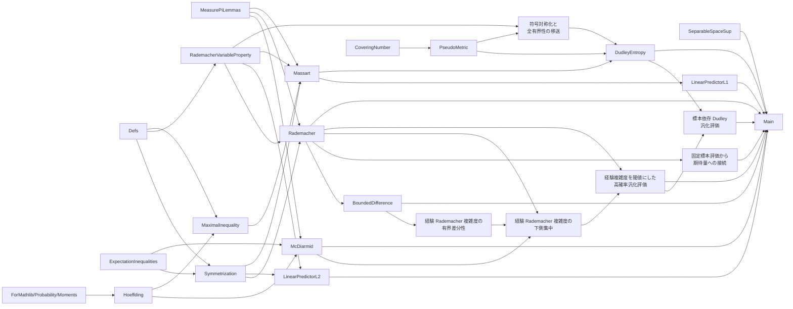

# `lean-rademacher` の実装概要

- 最終確認日: 2026-07-24
- 基準ブランチ: `ss`
- 基準コミット: `dbad457a8a319b70445dbf772e72b411818cd8a9`

## 0. 対象と現在の到達点

この文書は、統計的学習理論における Rademacher 複雑度と汎化評価を Lean 4 で形式化する `lean-rademacher` リポジトリの現行実装を整理したものである。利用者向けの主要定理は [`FoML/Main.lean`](../FoML/Main.lean)、ライブラリ全体の入口は [`FoML.lean`](../FoML.lean) に置かれている。

現在の実装は、次の五つの経路を一つの公開 API として接続している。

1. 一様偏差の期待値を symmetrization により期待 Rademacher 複雑度で評価する。
2. 一様偏差の有界差分性と McDiarmid の不等式から高確率汎化評価を得る。
3. 固定標本上の経験 Rademacher 複雑度の一様上界を、期待量と高確率汎化評価へ移す。
4. 経験 Rademacher 複雑度自身の下側集中を使い、観測標本の経験量を閾値に残した高確率汎化評価を得る。
5. 線形予測器または Dudley entropy integral による経験複雑度の評価を、上記の接続定理へ投入する。

とくに、以前分離していた次の二点は接続済みである。

- $\ell_2$ および $\ell_1/\ell_\infty$ 線形予測器について、経験評価から期待 Rademacher 複雑度、期待一様偏差、高確率汎化評価までの専用定理がある。
- Dudley の片側経験複雑度の評価を、符号対称化により絶対値付き経験複雑度へ変換し、標本一様な entropy 評価から期待量と高確率汎化評価を得られる。
- Dudley の右辺を標本一様な定数へ置き換えず、観測標本上の entropy integral をランダムな閾値に残す高確率汎化評価もある。

概念上の依存関係は次のようにまとめられる。



## 1. 共通の設定と中心定義

### 1.1 確率空間、関数クラス、標本

基本的な対象は以下である。

- $(\Omega,\mu)$: 基礎確率空間。主な汎化定理では `[IsProbabilityMeasure μ]` を仮定する。
- $X:\Omega\to\mathcal X$: 一つのデータ点を表す確率変数。
- $\iota$: 仮説またはパラメータの添字型。
- $f:\iota\to\mathcal X\to\mathbb R$: 関数クラス $\{f_i\}_{i\in\iota}$。
- $S:\operatorname{Fin}n\to\mathcal X$: サイズ $n$ の固定標本。
- $\omega:\operatorname{Fin}n\to\Omega$: 積空間上の点。
- $X\circ\omega:\operatorname{Fin}n\to\mathcal X$: ランダム標本。
- $\mu^n:=\operatorname{Measure.pi}(\lambda\_\Rightarrow\mu)$: i.i.d. 標本を生成する有限積測度。

同一分布の標本を、独立な確率変数を個別に列挙する代わりに、一つの写像 $X$ と有限積測度の座標射影で表している。

### 1.2 Rademacher 符号

[`FoML/Defs.lean`](../FoML/Defs.lean) の

```lean
def Signs (n : ℕ) : Type := Fin n → ({-1, 1} : Finset ℤ)
```

は $n$ 個の Rademacher 符号を有限型として表す。`Signs.card` により

$$
|\operatorname{Signs}(n)|=2^n
$$

が示される。経験 Rademacher 複雑度は、この有限型上の明示的な平均として定義される。

### 1.3 絶対値付き経験 Rademacher 複雑度

```lean
def empiricalRademacherComplexity
    (n : ℕ) (f : ι → 𝒳 → ℝ) (S : Fin n → 𝒳) : ℝ :=
  (Fintype.card (Signs n) : ℝ)⁻¹ *
    ∑ σ : Signs n, ⨆ i,
      |(n : ℝ)⁻¹ * ∑ k : Fin n, (σ k : ℝ) * f i (S k)|
```

は

$$
\widehat{\mathfrak R}_n(f;S)
=\frac1{2^n}\sum_{\sigma\in\{\pm1\}^n}
 \sup_{i\in\iota}
 \left|\frac1n\sum_{k=1}^n\sigma_k f_i(S_k)\right|
$$

を表す。汎化評価と線形予測器の最終的な経験評価では、この絶対値付き定義を使う。

### 1.4 片側経験 Rademacher 複雑度

```lean
def empiricalRademacherComplexity_without_abs
    (n : ℕ) (f : ι → 𝒳 → ℝ) (S : Fin n → 𝒳) : ℝ :=
  (Fintype.card (Signs n) : ℝ)⁻¹ *
    ∑ σ : Signs n, ⨆ i,
      (n : ℝ)⁻¹ * ∑ k : Fin n, (σ k : ℝ) * f i (S k)
```

は絶対値を外した

$$
\widehat{\mathfrak R}^{\mathrm{noabs}}_n(f;S)
=\frac1{2^n}\sum_{\sigma\in\{\pm1\}^n}
 \sup_{i\in\iota}
 \frac1n\sum_{k=1}^n\sigma_k f_i(S_k)
$$

を表す。Massart の補題と Dudley chaining の基本形は、この片側版を評価する。

一様有界性の下では

```lean
empiricalRademacherComplexity_without_abs_le_empiricalRademacherComplexity
```

により

$$
\widehat{\mathfrak R}^{\mathrm{noabs}}_n(f;S)
\le
\widehat{\mathfrak R}_n(f;S)
$$

が示される。この不等式だけでは片側版の上界を絶対値付き版へ移せないため、Dudley との接続には後述の符号対称化を使う。

### 1.5 期待 Rademacher 複雑度

```lean
def rademacherComplexity
    (n : ℕ) (f : ι → 𝒳 → ℝ)
    (μ : Measure Ω) (X : Ω → 𝒳) : ℝ :=
  μⁿ[fun ω : Fin n → Ω ↦
    empiricalRademacherComplexity n f (X ∘ ω)]
```

は、経験量をランダム標本について積分した

$$
\mathfrak R_n(f;\mu,X)
=\mathbb E_{\omega\sim\mu^n}
 \left[\widehat{\mathfrak R}_n(f;X\circ\omega)\right]
$$

を表す。

### 1.6 一様偏差

```lean
def uniformDeviation
    (n : ℕ) (f : ι → 𝒳 → ℝ)
    (μ : Measure Ω) (X : Ω → 𝒳)
    (S : Fin n → 𝒳) : ℝ :=
  ⨆ i, |(n : ℝ)⁻¹ * ∑ k : Fin n, f i (S k) -
    μ[fun ω' ↦ f i (X ω')]|
```

は

$$
\operatorname{UD}_n(f;\mu,X;S)
=\sup_{i\in\iota}
 \left|
   \frac1n\sum_{k=1}^n f_i(S_k)
   -\mathbb E_\mu[f_i(X)]
 \right|
$$

を表す。標本を見た後に仮説を選ぶ場合でも、関数クラス全体の汎化ギャップを同時に評価する量である。

## 2. 確率論的な共通基盤

### 2.1 積測度の座標分布と独立性

[`FoML/MeasurePiLemmas.lean`](../FoML/MeasurePiLemmas.lean) は有限積測度について次を提供する。

| 宣言 | 内容 |
|---|---|
| `pi_map_eval` | $\mu^n$ を一つの座標評価写像で push-forward すると $\mu$ になる。 |
| `pi_eval_iIndepFun` | $\mu^n$ 上の座標評価関数族が独立である。 |
| `pi_comp_eval_iIndepFun` | 各座標に同じ可測写像 $X$ を合成しても独立性が保たれる。 |

これらは積測度版 McDiarmid の不等式と、標本平均・母平均の積分操作を支える。

### 2.2 符号反転、直交性、PMF 表現

[`FoML/RademacherVariableProperty.lean`](../FoML/RademacherVariableProperty.lean) の主要な基盤は以下である。

| 宣言 | 内容 |
|---|---|
| `rademacher_flip` | 一座標の符号を反転する involution。 |
| `sign_sum_eq_zero` | 各座標について符号の総和が $0$。 |
| `rademacher_orthogonality` | $k\ne l$ なら $\sum_\sigma\sigma_k\sigma_l=0$。 |
| `signVecPMF` | `Signs n` 上の一様確率質量関数。 |
| `empiricalRademacherComplexity_pmf` | 絶対値付き経験量の PMF 積分版。 |
| `empiricalRademacherComplexity_pmf_without_abs` | 片側経験量の PMF 積分版。 |
| `..._eq_..._pmf` | 有限平均による定義と PMF 積分版の同一性。 |

有限和で定義した経験量を、測度論的な maximal inequality や Massart の補題へ渡すための接続層である。

このファイルには、現在さらに次の一般補題がある。

| 宣言 | 内容 |
|---|---|
| `empiricalRademacherComplexity_nonneg` | 経験 Rademacher 複雑度の非負性。 |
| `empiricalRademacherComplexity_comp` | 関数クラスの定義域写像と標本写像の整合性。 |
| `signSymmetrization` | 各関数とその負号を含むクラス。 |
| `IsNegClosed` | 関数クラスが点ごとの負号で閉じていること。 |
| `empiricalRademacherComplexity_eq_without_abs_signSymmetrization` | 絶対値付き経験量と符号対称化クラスの片側経験量の等式。 |
| `empiricalRademacherComplexity_eq_without_abs_of_neg_closed` | 負号で閉じたクラスにおける絶対値付き版と片側版の等式。 |

### 2.3 指数傾斜と Hoeffding の補題

[`FoML/ExpectationInequalities.lean`](../FoML/ExpectationInequalities.lean) は、一様なノルム上界から期待値のノルム上界を得る補題を提供する。

[`FoML/ForMathlib/Probability/Moments.lean`](../FoML/ForMathlib/Probability/Moments.lean) は Mathlib の補完層として、次を形式化する。

- 有界確率変数に対する指数関数の可積分性。
- exponential tilting 後の分散上界 `tilt_var_bound`。
- MGF と tilted expectation の微分公式。
- cumulant generating function の一階・二階微分。

これを用いて [`FoML/Hoeffding.lean`](../FoML/Hoeffding.lean) は `ProbabilityTheory.hoeffding` を示す。$\mathbb E X=0$ かつ $a\le X\le b$ がほとんど至る所で成立するとき、

$$
\operatorname{mgf}_X(t)
\le
\exp\!\left(\frac{t^2(b-a)^2}{8}\right)
$$

が全ての $t\in\mathbb R$ について成立する。

### 2.4 McDiarmid の不等式

[`FoML/McDiarmid.lean`](../FoML/McDiarmid.lean) は、独立性と反復積分から McDiarmid の不等式を構成する。

独立な確率変数族 $X_i$ と有界差分条件

$$
|g(x)-g(x^{(i\leftarrow x')})|\le c_i
$$

の下で、`mcdiarmid_inequality_pos` は $t\sum_i c_i^2\le1$ と $\varepsilon\ge0$ から

$$
\Pr\{g(X)-\mathbb Eg(X)\ge\varepsilon\}
\le
\exp(-2\varepsilon^2t)
$$

を与える。

| 宣言 | 役割 |
|---|---|
| `mcdiarmid_inequality_pos` | 一般の独立な有限族に対する上側 tail。 |
| `mcdiarmid_inequality_neg` | 下側 tail。 |
| `mcdiarmid_inequality_pos'` | 同じ $X$ を積測度の各座標に適用する i.i.d. 版。 |
| `mcdiarmid_inequality_neg'` | 下側 tail の i.i.d. 積測度版。 |
| `bounded_difference_iff` | 絶対値付き感度条件と片側条件の同値。 |

## 3. Rademacher 複雑度による汎化評価

### 3.1 Symmetrization

[`FoML/Symmetrization.lean`](../FoML/Symmetrization.lean) の中心は

```lean
symmetrization_equation
abs_symmetrization_equation
```

である。`abs_symmetrization_equation` は ghost sample $(X'_k)$ を導入した差

$$
\sup_i
\left|
  \sum_k(f_i(X_k)-f_i(X'_k))
\right|
$$

の期待値を、Rademacher 符号を挿入した

$$
2^{-n}\sum_\sigma
\sup_i
\left|
  \sum_k\sigma_k(f_i(X_k)-f_i(X'_k))
\right|
$$

の期待値へ変換する。可算な添字型、非空性、可測性、一様有界性が明示的な仮定として現れる。

### 3.2 期待一様偏差

[`FoML/Rademacher.lean`](../FoML/Rademacher.lean) の

```lean
expectation_le_rademacher
```

は、非正規化形

$$
\mathbb E\left[
 \sup_i
 \left|
   \sum_{k=1}^n f_i(X_k)
   -n\mathbb E f_i(X)
 \right|
\right]
\le
2n\,\mathfrak R_n(f;\mu,X)
$$

を示す。

[`FoML/Main.lean`](../FoML/Main.lean) の公開定理

```lean
uniform_deviation_expectation_le_two_smul_rademacher_complexity
```

は $n>0$ の下でこれを正規化し、

$$
\mathbb E_{S\sim\mu^n}
 [\operatorname{UD}_n(f;\mu,X;S)]
\le
2\mathfrak R_n(f;\mu,X)
$$

を与える。

### 3.3 一様偏差の有界差分性

[`FoML/BoundedDifference.lean`](../FoML/BoundedDifference.lean) の

```lean
uniformDeviation_bounded_difference
```

は $|f_i(x)|\le b$ の下で、一標本だけを置換したとき

$$
|\operatorname{UD}_n(S)
 -\operatorname{UD}_n(S^{(k\leftarrow x')})|
\le
\frac{2b}{n}
$$

を示す。

同じファイルの `uniformDeviation_measurable` は、可算クラスかつ各 $f_i$ が可測なら、標本を一様偏差へ送る写像が可測であることを示す。

同じく

```lean
empiricalRademacherComplexity_bounded_difference
```

は、絶対値付き経験 Rademacher 複雑度について

$$
\left|
  \widehat{\mathfrak R}_n(f;S)
  -
  \widehat{\mathfrak R}_n(f;S^{(k\leftarrow x')})
\right|
\le
\frac{2b}{n}
$$

を示す。各 Rademacher 符号について正規化符号和の差を評価し、その後で関数クラス上の上限と有限符号平均へ評価を移している。

### 3.4 可算クラスの tail 評価

`uniform_deviation_mcdiarmid_tail` は、$t b^2\le1/2$ と $\varepsilon\ge0$ の下で

$$
\Pr\{
  \operatorname{UD}_n-\mathbb E\operatorname{UD}_n
  \ge\varepsilon
\}
\le
\exp(-\varepsilon^2tn)
$$

を与える。

期待値評価と合成した定理は次の二つである。

```lean
uniform_deviation_tail_bound_countable
uniform_deviation_tail_bound_countable_of_pos
```

$b>0$ の最適化形は

$$
\Pr\{
  \operatorname{UD}_n
  \ge 2\mathfrak R_n+\varepsilon
\}
\le
\exp\!\left(-\frac{n\varepsilon^2}{2b^2}\right)
$$

を示す。Lean の命題では、悪い事象の測度を `ENNReal.toReal` により実数へ移して評価している。

### 3.5 経験 Rademacher 複雑度を使う標本依存 tail

`empiricalRademacherComplexity_lower_tail_countable` とその最適化形

```lean
empiricalRademacherComplexity_lower_tail_countable_of_pos
```

は、経験 Rademacher 複雑度の有界差分性と `mcdiarmid_inequality_neg'` を合成する。$b>0$ のとき

$$
\Pr\left\{
  \widehat{\mathfrak R}_n(f;S)
  -
  \mathfrak R_n(f;\mu,X)
  \le-\varepsilon
\right\}
\le
\exp\!\left(-\frac{n\varepsilon^2}{2b^2}\right)
$$

を得る。

これと 3.4 の期待 Rademacher 複雑度を使う tail を union bound で合成した定理が

```lean
uniform_deviation_tail_bound_countable_of_empirical_complexity
```

である。結論は

$$
\Pr\left\{
  \operatorname{UD}_n(f;S)
  \ge
  2\widehat{\mathfrak R}_n(f;S)+3\varepsilon
\right\}
\le
2\exp\!\left(-\frac{n\varepsilon^2}{2b^2}\right).
$$

右辺の閾値は観測標本 $S$ に依存し、全標本に共通する経験複雑度上界 $C$ を必要としない。

### 3.6 可分クラスへの拡張

[`FoML/SeparableSpaceSup.lean`](../FoML/SeparableSpaceSup.lean) の

```lean
separableSpaceSup_eq_real
```

は、可分位相空間上の連続関数について

$$
\sup_{i\in\iota}g(i)
=
\sup_{m\in\mathbb N}
g(\operatorname{denseSeq}(\iota,m))
$$

を示す。

`FoML/Main.lean` ではこの結果を用いて、稠密可算部分クラスへ制限しても以下の量が変わらないことを示す。

| 宣言 | 対象 |
|---|---|
| `empiricalRademacherComplexity_eq` | 固定標本上の経験 Rademacher 複雑度。 |
| `RademacherComplexity_eq` | 期待 Rademacher 複雑度。 |
| `uniformDeviation_eq` | 一様偏差。 |

可分クラス向けの主な tail 定理は

```lean
uniform_deviation_tail_bound_separable
uniform_deviation_tail_bound_separable_of_pos
uniform_deviation_tail_bound_separable_of_empirical_complexity
```

である。可算性の代わりに、添字空間の可分性、点ごとのパラメータ連続性、一様有界性などを仮定する。一様偏差の等式では、母平均のパラメータ連続性を得るため `FirstCountableTopology` も用いる。

## 4. 固定標本評価から期待量・汎化評価への接続

### 4.1 経験複雑度の可測性と可積分性

[`FoML/Rademacher.lean`](../FoML/Rademacher.lean) には次が実装されている。

| 宣言 | 内容 |
|---|---|
| `empiricalRademacherComplexity_le_of_bounded` | $|f_i(x)|\le b$ なら経験複雑度も $b$ 以下。 |
| `measurable_empiricalRademacherComplexity_comp` | ランダム標本上の経験複雑度の可測性。 |
| `integrable_empiricalRademacherComplexity_comp` | 一様有界な可算クラスに対する可積分性。 |
| `rademacherComplexity_le_of_ae_empirical_le` | ほとんど至る所の経験評価を期待量へ移す。 |
| `rademacherComplexity_le_of_empirical_le` | 全標本での経験評価を期待量へ移す。 |
| `rademacherComplexity_le_of_empirical_le_countable` | 可算・可測・一様有界クラス向けの公開しやすい形。 |

基本的な接続は

$$
\left(
  \forall S,\quad
  \widehat{\mathfrak R}_n(f;S)\le C
\right)
\Longrightarrow
\mathfrak R_n(f;\mu,X)\le C
$$

である。

### 4.2 決定論的閾値を使う公開定理

`FoML/Main.lean` は、固定標本で一様な評価を期待一様偏差と tail 評価へ直接渡す。

| 対象 | 可算クラス | 可分クラス |
|---|---|---|
| 期待 Rademacher 複雑度 | `rademacherComplexity_le_of_empirical_le_countable` | `rademacherComplexity_le_of_empirical_le_separable` |
| 期待一様偏差 | `uniform_deviation_expectation_le_of_empirical_le_countable` | `uniform_deviation_expectation_le_of_empirical_le_separable` |
| 高確率一様偏差 | `uniform_deviation_tail_bound_countable_of_empirical_le` | `uniform_deviation_tail_bound_separable_of_empirical_le` |

可分クラス版の最適化された tail 定理は

$$
\Pr\{
  \operatorname{UD}_n
  \ge 2C+\varepsilon
\}
\le
\exp\!\left(-\frac{n\varepsilon^2}{2b^2}\right)
$$

という形を持つ。ここで $C$ は経験 Rademacher 複雑度の全標本一様上界、$b$ は関数値の一様上界であり、役割が異なる。

### 4.3 標本依存閾値を使う公開定理

全標本一様な定数 $C$ を経由しない経路も実装されている。

| 対象 | 宣言 |
|---|---|
| 経験複雑度の下側集中 | `empiricalRademacherComplexity_lower_tail_countable`, `empiricalRademacherComplexity_lower_tail_countable_of_pos` |
| 可算クラスの標本依存 tail | `uniform_deviation_tail_bound_countable_of_empirical_complexity` |
| 可分クラスの標本依存 tail | `uniform_deviation_tail_bound_separable_of_empirical_complexity` |

可分クラス版も

$$
\Pr\left\{
  \operatorname{UD}_n(f;S)
  \ge
  2\widehat{\mathfrak R}_n(f;S)+3\varepsilon
\right\}
\le
2\exp\!\left(-\frac{n\varepsilon^2}{2b^2}\right)
$$

を示す。稠密可算部分クラスへの還元により、経験 Rademacher 複雑度と一様偏差の両方を保存してから可算クラス版を適用する。

## 5. $\ell_2$ 制約付き線形予測器

### 5.1 関数クラス

[`FoML/LinearPredictorL2.lean`](../FoML/LinearPredictorL2.lean) の

```lean
linearPredictorL2
```

は

$$
f_w(x)=\langle w,x\rangle
$$

を、重みと入力をそれぞれ

```lean
Metric.closedBall 0 W
Metric.closedBall 0 X
```

に制限した関数として定義する。

`continuous_linearPredictorL2_weight` と
`continuous_linearPredictorL2_input` は、パラメータ方向と入力方向の連続性を与える。`abs_linearPredictorL2_le` は

$$
|f_w(x)|\le XW
$$

を示し、汎化定理の有界性仮定を供給する。

### 5.2 経験 Rademacher 複雑度

主な経験評価は

```lean
linear_predictor_l2_empirical_bound
```

であり、任意の固定標本 $S$ について

$$
\widehat{\mathfrak R}_n(\mathcal F_{2};S)
\le
\frac{XW}{\sqrt n}
$$

を示す。証明では次を用いる。

- `weighted_sum_norm_squared_expansion` による符号付き和のノルム二乗展開。
- `rademacher_orthogonality` による非対角交差項の消去。
- Cauchy--Schwarz による符号平均の二乗平均評価。

`linear_predictor_l2_bound` は、任意の添字型から閉球内の重みを与える旧来の固定標本 wrapper である。関数クラス全体を後続の接続定理へ使う場合は `linear_predictor_l2_empirical_bound` が直接対応する。

### 5.3 期待量と高確率汎化評価

`FoML/Main.lean` は次を公開する。

| 宣言 | 結論 |
|---|---|
| `linear_predictor_l2_rademacher_complexity_bound` | $\mathfrak R_n\le XW/\sqrt n$。 |
| `linear_predictor_l2_uniform_deviation_expectation_bound` | $\mathbb E[\operatorname{UD}_n]\le2XW/\sqrt n$。 |
| `linear_predictor_l2_uniform_deviation_tail_bound` | 経験評価を決定論的閾値にした高確率汎化評価。 |

$X,W>0$ の tail 定理は

$$
\Pr\left\{
  \operatorname{UD}_n
  \ge
  \frac{2XW}{\sqrt n}+\varepsilon
\right\}
\le
\exp\!\left(
  -\frac{n\varepsilon^2}{2(XW)^2}
\right)
$$

を与える。

## 6. $\ell_1/\ell_\infty$ 制約付き線形予測器

### 6.1 幾何学的な定義

[`FoML/LinearPredictorL1.lean`](../FoML/LinearPredictorL1.lean) は次を定義する。

| 宣言 | 内容 |
|---|---|
| `l1Norm` | $\|w\|_1=\sum_j|w_j|$。 |
| `L1Ball W` | $\|w\|_1\le W$ を満たす Euclidean vector の部分型。 |
| `LinftyBall Xinf` | 全座標で $|x_j|\le X_\infty$ を満たす部分型。 |
| `linearPredictorL1` | $f_w(x)=\sum_jw_jx_j$。 |
| `coordSigned` | $(j,\pm)$ に対応する signed coordinate。 |
| `abs_sum_mul_le_l1_mul` | $\ell_1/\ell_\infty$ duality による有限和の評価。 |

`continuous_linearPredictorL1_weight`,
`continuous_linearPredictorL1_input`,
`abs_linearPredictorL1_le` は、それぞれパラメータ連続性、入力方向の連続性、

$$
|f_w(x)|\le X_\infty W
$$

を提供する。

### 6.2 Maximal inequality と Massart の補題

[`FoML/MaximalInequality.lean`](../FoML/MaximalInequality.lean) の
`ProbabilityTheory.maximal_inequality_supR` は、有限個の独立な中心化和に対する expected maximum の評価を与える。

[`FoML/Massart.lean`](../FoML/Massart.lean) の `massart_lemma_pmf` は、有限クラス $J$ の片側経験 Rademacher 複雑度を

$$
\max_{j\in J}
\sqrt{
  \sum_{k=1}^n
  \left(\frac{|F_j(S_k)|}{n}\right)^2
}
\sqrt{2\log|J|}
$$

で評価する。

$\ell_1$ 線形クラスでは、サイズ $2d$ の signed-coordinate class にこの補題を適用し、$\ell_1/\ell_\infty$ duality により元のクラスへ戻す。

### 6.3 経験量、期待量、汎化評価

`linear_predictor_l1_empirical_bound` は $d,n>0$ の下で

$$
\widehat{\mathfrak R}_n(\mathcal F_{1};S)
\le
\frac{X_\infty W}{\sqrt n}
\sqrt{2\log(2d)}
$$

を示す。

`FoML/Main.lean` の公開定理は次の通りである。

| 宣言 | 結論 |
|---|---|
| `linear_predictor_l1_rademacher_complexity_bound` | 上記の経験評価と同じ定数による期待 Rademacher 複雑度の評価。 |
| `linear_predictor_l1_uniform_deviation_expectation_bound` | 期待一様偏差をその定数の二倍で評価。 |
| `linear_predictor_l1_uniform_deviation_tail_bound` | 同じ定数を決定論的閾値にした高確率汎化評価。 |

$X_\infty,W>0$ の tail 定理では、複雑度項

$$
C_{1}
=
\frac{X_\infty W}{\sqrt n}
\sqrt{2\log(2d)}
$$

と関数値上界 $b=X_\infty W$ を区別し、

$$
\Pr\{
  \operatorname{UD}_n
  \ge 2C_1+\varepsilon
\}
\le
\exp\!\left(
  -\frac{n\varepsilon^2}{2(X_\infty W)^2}
\right)
$$

を示す。

## 7. Dudley entropy integral

### 7.1 経験擬距離

[`FoML/PseudoMetric.lean`](../FoML/PseudoMetric.lean) は

```lean
empiricalNorm S f
empiricalDist S f g
EmpiricalFunctionSpace F S
```

を定義する。

$$
\|f\|_S
=
\sqrt{
  \frac1n\sum_{k=1}^n f(S_k)^2
},
\qquad
d_S(f,g)=\|f-g\|_S
$$

である。標本点上で一致する異なる関数の距離が $0$ になり得るため、metric ではなく pseudometric を使う。

`EmpiricalFunctionSpace F S` は添字 $i:\iota$ を保持しつつ $F_i$ に coercion され、経験擬距離を備える。

符号対称化に必要な補題として

```lean
empiricalNorm_neg
empiricalDist_neg_neg
```

があり、経験ノルムと経験距離が同時の負号で不変であることを示す。

### 7.2 被覆数

[`FoML/CoveringNumber.lean`](../FoML/CoveringNumber.lean) は、全有界な集合 $A$ と正の半径 $\varepsilon$ に対し、有限 $\varepsilon$-cover の最小要素数を定義する。

| 宣言 | 内容 |
|---|---|
| `coveringNumber` | $\varepsilon>0$ なら最小被覆数、$\varepsilon\le0$ なら $0$。 |
| `coveringNumber_antitone` | 正の半径上で被覆数が反単調。 |
| `coveringNumber_nonzero` | 非空な集合では正の半径に対する被覆数が正。 |
| `coveringNumber_aemeasurable` | 被覆数が Lebesgue 測度に関して a.e. measurable。 |
| `coveringFinset` | 最小被覆数を実現する有限中心集合を選ぶ。 |
| `coveringFinset_cover` | 選択した有限集合の被覆性。 |
| `coveringFinset_card` | その要素数が被覆数に一致すること。 |

`coveringNumber` は全有界性の証明項を引数に持つ。符号対称化後の被覆数では、名前付き定理 `signSymmetrization_totallyBounded` が生成する証明項を一貫して用いる。

### 7.3 片側版 Dudley 評価

[`FoML/DudleyEntropy.lean`](../FoML/DudleyEntropy.lean) の chaining は次の流れで構成される。

1. dyadic radius $e_j=c/2^j$ を取る。
2. 各スケールで `coveringFinset` から近似 `coverApprox` を選ぶ。
3. `chainApprox` により各 $F_i$ を telescoping sum に分解する。
4. 残差を経験距離で評価する。
5. 各 increment を隣接二スケールの有限被覆から作る有限集合に入れる。
6. increment ごとに `massart_lemma_pmf` を適用する。
7. dyadic sum を entropy integral で評価する。
8. `choose_dyadic_scale_for_epsilon` で打切りスケールを選ぶ。

内部定理 `dudley_entropy_integral'` と公開 wrapper

```lean
dudley_entropy_integral_bound
```

は、$n>0$, $\varepsilon>0$, $\varepsilon<c/2$、

$$
\forall i,\quad \|F_i\|_S\le c
$$

および `EmpiricalFunctionSpace F S` 全体の全有界性の下で

$$
\widehat{\mathfrak R}^{\mathrm{noabs}}_n(F;S)
\le
4\varepsilon
+
\frac{12}{\sqrt n}
\int_{\varepsilon}^{c/2}
  \sqrt{\log N_F(u;S)}\,du
$$

を示す。

### 7.4 符号対称化と絶対値付き版

`signSymmetrization F` は添字型を $\iota\times\operatorname{Bool}$ に拡張し、各 $F_i$ と $-F_i$ を含むクラスを作る。固定標本上の一様有界性の下で

```lean
empiricalRademacherComplexity_eq_without_abs_signSymmetrization
```

が

$$
\widehat{\mathfrak R}_n(F;S)
=
\widehat{\mathfrak R}^{\mathrm{noabs}}_n(F^\pm;S)
$$

を示す。

正側と負側から符号対称化クラスへの写像は経験擬距離に関する isometry である。この二つの像の和集合を使い、

```lean
signSymmetrization_totallyBounded
```

は元のクラスの全有界性を $F^\pm$ へ移す。

これらを片側版 Dudley 評価と合成した内部定理・公開定理は

```lean
dudley_entropy_integral_abs
dudley_entropy_integral_bound_abs
```

である。結論は

$$
\widehat{\mathfrak R}_n(F;S)
\le
4\varepsilon
+
\frac{12}{\sqrt n}
\int_{\varepsilon}^{c/2}
  \sqrt{\log N_{F^\pm}(u;S)}\,du
$$

となる。

元のクラスが `IsNegClosed F` を満たす場合は

```lean
dudley_entropy_integral_abs_of_neg_closed
dudley_entropy_integral_bound_abs_of_neg_closed
```

により $F^\pm$ へ拡大せず、元の被覆数 $N_F$ を使える。

### 7.5 標本一様な entropy 評価から汎化評価へ

Dudley の右辺は一般に標本 $S$ に依存する。期待量へ移す公開定理は、次を全標本について仮定する。

- `EmpiricalFunctionSpace f S` 全体が全有界。
- 全ての $i$ について $\|f_i\|_S\le c$。
- 符号対称化後の entropy integral を含む Dudley の右辺が、標本非依存の $C$ 以下。

これに加えて、添字型の非空性と可分位相、各 $f_i\circ X$ の可測性、関数値の一様上界、点ごとのパラメータ連続性を仮定する。

このとき

```lean
rademacher_complexity_le_dudley_of_uniform_entropy
```

は

$$
\mathfrak R_n(f;\mu,X)\le C
$$

を示す。

さらに

```lean
uniform_deviation_tail_bound_separable_of_uniform_dudley
```

は、さらに入力空間の可測構造、`X` と各 $f_i$ の可測性、および `FirstCountableTopology` を仮定して

$$
\Pr\{
  \operatorname{UD}_n
  \ge 2C+\varepsilon
\}
\le
\exp\!\left(-\frac{n\varepsilon^2}{2b^2}\right)
$$

を示す。

ここでは符号対称化クラスの被覆数を直接用いる。現在の core 接続には

$$
N_{F^\pm}(u;S)\le2N_F(u;S)
$$

という追加評価は使っておらず、この被覆数比較自体は実装していない。

### 7.6 観測標本上の entropy integral を使う汎化評価

全標本で共通する数値上界 $C$ を要求しない公開定理は

```lean
uniform_deviation_tail_bound_separable_of_dudley
```

である。各標本 $S$ に対し

$$
D_\alpha(S)
=
4\alpha
+
\frac{12}{\sqrt n}
\int_\alpha^{c/2}
  \sqrt{\log N_{F^\pm}(u;S)}\,du
$$

と書く。この定理は、全ての $S$ について経験関数空間の全有界性と $\|f_i\|_S\le c$ を仮定するが、$D_\alpha(S)\le C$ という標本一様な数値評価は仮定しない。結論は

$$
\Pr\left\{
  \operatorname{UD}_n(f;S)
  \ge
  2D_\alpha(S)+3\varepsilon
\right\}
\le
2\exp\!\left(-\frac{n\varepsilon^2}{2b^2}\right).
$$

証明は、固定された観測標本上で

$$
\widehat{\mathfrak R}_n(f;S)\le D_\alpha(S)
$$

を `dudley_entropy_integral_bound_abs` から得て、4.3 の可分クラス向け標本依存 tail の事象包含へ渡す。したがって Dudley の標本依存性を消すための期待値評価や supremum 評価は不要である。

## 8. `FoML/Main.lean` の公開 API

### 8.1 抽象的な汎化定理

| 分類 | 宣言 |
|---|---|
| 期待一様偏差 | `uniform_deviation_expectation_le_two_smul_rademacher_complexity` |
| 中心化 tail | `uniform_deviation_mcdiarmid_tail` |
| 経験 Rademacher 複雑度の下側 tail | `empiricalRademacherComplexity_lower_tail_countable`, `empiricalRademacherComplexity_lower_tail_countable_of_pos` |
| 可算クラス | `uniform_deviation_tail_bound_countable`, `uniform_deviation_tail_bound_countable_of_pos` |
| 可分クラス | `uniform_deviation_tail_bound_separable`, `uniform_deviation_tail_bound_separable_of_pos` |
| 標本依存・可算クラス | `uniform_deviation_tail_bound_countable_of_empirical_complexity` |
| 標本依存・可分クラス | `uniform_deviation_tail_bound_separable_of_empirical_complexity` |

### 8.2 固定標本評価からの接続

| 分類 | 宣言 |
|---|---|
| 可算クラスの期待一様偏差 | `uniform_deviation_expectation_le_of_empirical_le_countable` |
| 可算クラスの tail | `uniform_deviation_tail_bound_countable_of_empirical_le` |
| 可分クラスの期待 Rademacher 複雑度 | `rademacherComplexity_le_of_empirical_le_separable` |
| 可分クラスの期待一様偏差 | `uniform_deviation_expectation_le_of_empirical_le_separable` |
| 可分クラスの tail | `uniform_deviation_tail_bound_separable_of_empirical_le` |

### 8.3 線形予測器

| 分類 | $\ell_2$ | $\ell_1/\ell_\infty$ |
|---|---|---|
| 固定標本 wrapper | `linear_predictor_l2_bound` | `linear_predictor_l1_bound` |
| 期待 Rademacher 複雑度 | `linear_predictor_l2_rademacher_complexity_bound` | `linear_predictor_l1_rademacher_complexity_bound` |
| 期待一様偏差 | `linear_predictor_l2_uniform_deviation_expectation_bound` | `linear_predictor_l1_uniform_deviation_expectation_bound` |
| 高確率一様偏差 | `linear_predictor_l2_uniform_deviation_tail_bound` | `linear_predictor_l1_uniform_deviation_tail_bound` |

### 8.4 Dudley

| 分類 | 宣言 |
|---|---|
| 片側経験複雑度 | `dudley_entropy_integral_bound` |
| 絶対値付き経験複雑度 | `dudley_entropy_integral_bound_abs` |
| 負号閉クラス | `dudley_entropy_integral_bound_abs_of_neg_closed` |
| 標本一様 entropy 評価から期待量 | `rademacher_complexity_le_dudley_of_uniform_entropy` |
| 標本一様 entropy 評価から tail | `uniform_deviation_tail_bound_separable_of_uniform_dudley` |
| 観測標本上の entropy integral から tail | `uniform_deviation_tail_bound_separable_of_dudley` |

## 9. 現在の接続関係と注意点

### 9.1 固定標本評価から汎化評価への接続

決定論的閾値を使う接続は実装済みである。全標本について

$$
\widehat{\mathfrak R}_n(f;S)\le C
$$

が成立すれば、可積分性を確認した上で

$$
\mathfrak R_n(f;\mu,X)\le C,
\qquad
\mathbb E[\operatorname{UD}_n]\le2C
$$

を得られ、さらに一様有界性 $|f_i(x)|\le b$ から

$$
\Pr\{
  \operatorname{UD}_n\ge2C+\varepsilon
\}
\le
\exp\!\left(-\frac{n\varepsilon^2}{2b^2}\right)
$$

へ進める。

線形予測器については、経験評価からこの結論までを合成した専用定理がある。Dudley については、全標本で共通する entropy 上界 $C$ を仮定する専用定理がある。

これとは別に、経験 Rademacher 複雑度を観測標本ごとの閾値として残す接続も実装済みである。`empiricalRademacherComplexity_bounded_difference` と下側 McDiarmid 評価により

$$
\mathfrak R_n(f;\mu,X)
\le
\widehat{\mathfrak R}_n(f;S)+\varepsilon
$$

が高確率で成立することを示し、期待 Rademacher 複雑度による一様偏差評価と union bound で合成する。その結果、標本一様な $C$ を仮定せず

$$
\Pr\left\{
  \operatorname{UD}_n
  \ge
  2\widehat{\mathfrak R}_n(f;S)+3\varepsilon
\right\}
\le
2\exp\!\left(-\frac{n\varepsilon^2}{2b^2}\right)
$$

を得る。Dudley の観測標本上の右辺もこの経路へ直接代入できる。

### 9.2 Dudley の片側版と絶対値付き版

`dudley_entropy_integral_bound` は片側経験複雑度を評価する。絶対値付き版への接続では、比較不等式を逆向きに使わず、

$$
\widehat{\mathfrak R}_n(F;S)
=
\widehat{\mathfrak R}^{\mathrm{noabs}}_n(F^\pm;S)
$$

という符号対称化の等式を使う。

`dudley_entropy_integral_bound_abs` の右辺は $F^\pm$ の被覆数を含む。元のクラスが負号で閉じていれば、`dudley_entropy_integral_bound_abs_of_neg_closed` により元の被覆数を使える。

### 9.3 三つの定数の役割

応用定理では次の定数を混同しないことが重要である。

- $b$: 関数値の一様上界。McDiarmid の指数部に現れる。
- $c$: Dudley で使う経験ノルムの一様上界。積分上端 $c/2$ に現れる。
- $C$: 決定論的閾値を使う経路における、経験 Rademacher 複雑度または Dudley の右辺の標本一様な数値上界。汎化評価の閾値 $2C+\varepsilon$ に現れる。

標本依存経路では $C$ を使わず、$\widehat{\mathfrak R}_n(f;S)$ または $D_\alpha(S)$ が閾値に現れる。この場合の slack は $3\varepsilon$、確率上界の前係数は $2$ になる。

たとえば $\ell_1$ 線形クラスでは

$$
b=X_\infty W,
\qquad
C=
\frac{X_\infty W}{\sqrt n}
\sqrt{2\log(2d)}
$$

である。

### 9.4 可測性と可分性

非可算クラスの上限を直接可測とするのではなく、点ごとのパラメータ連続性を使って稠密可算部分クラスへ還元する。期待 Rademacher 複雑度の評価には `SeparableSpace`、一様偏差の等式と tail 評価にはさらに `FirstCountableTopology` が現れる。

### 9.5 $n=0$ と正値条件

Lean の実数では $0^{-1}=0$ なので、中心定義は $n=0$ でも総関数である。一方、正規化、平方根、Dudley integral を本質的に使う応用 API では $0<n$ を明示する。tail 定理の一部は $n=0$ を確率が $1$ 以下という自明な場合として内部処理する。

### 9.6 証明項に依存する被覆数

`coveringNumber` は全有界性の証明を引数に取る。Lean では証明の無関係性により数学的な値は証明の選択に依存しないが、定理の式には証明項が現れる。符号対称化後については `signSymmetrization_totallyBounded` を共通して使うことで、公開 API の式を安定させている。

### 9.7 現在扱っていないもの

次は現行の主要 API には含まれていない。

- Lipschitz loss に対する contraction inequality。
- RKHS の具体的な複雑度評価。
- Lipschitz 関数やニューラルネットワークに対する具体的な被覆数評価。
- 符号対称化前後の被覆数を係数 $2$ で比較する補題。

### 9.8 標本依存評価の定数

このリポジトリの経験 Rademacher 複雑度は、関数クラス上の上限の内側に絶対値を持つ。現在の共通仮定 $|f_i(x)|\le b$ から一標本置換の感度を $2b/n$ と評価しているため、経験複雑度の下側 tail も一様偏差の tail も

$$
\exp\!\left(-\frac{n\varepsilon^2}{2b^2}\right)
$$

となる。値域幅を直接仮定する片側版などを追加すれば定数を改善できる可能性はあるが、現在の公開定理は既存の絶対値付き定義と一様有界性の API に揃えている。

## 10. ファイルごとの役割

| ファイル | 主な役割 |
|---|---|
| [`Defs.lean`](../FoML/Defs.lean) | 符号、二種類の経験 Rademacher 複雑度、期待 Rademacher 複雑度、一様偏差。 |
| [`MeasurePiLemmas.lean`](../FoML/MeasurePiLemmas.lean) | 積測度の座標分布と独立性。 |
| [`ExpectationInequalities.lean`](../FoML/ExpectationInequalities.lean) | 一様上界から期待値上界を得る補助定理。 |
| [`ForMathlib/Probability/Moments.lean`](../FoML/ForMathlib/Probability/Moments.lean) | exponential tilting、MGF/CGF 微分、分散評価。 |
| [`Hoeffding.lean`](../FoML/Hoeffding.lean) | Hoeffding の補題。 |
| [`McDiarmid.lean`](../FoML/McDiarmid.lean) | 一般版・下側版と、それぞれの i.i.d. 積測度版 McDiarmid。 |
| [`Symmetrization.lean`](../FoML/Symmetrization.lean) | ghost sample と Rademacher 符号による symmetrization。 |
| [`Rademacher.lean`](../FoML/Rademacher.lean) | 期待一様偏差評価、経験量の可測性・可積分性、固定標本評価から期待量への接続。 |
| [`BoundedDifference.lean`](../FoML/BoundedDifference.lean) | 一様偏差と経験 Rademacher 複雑度の感度 $2b/n$、一様偏差の可測性。 |
| [`SeparableSpaceSup.lean`](../FoML/SeparableSpaceSup.lean) | 可分空間上の上限を稠密可算列へ還元。 |
| [`RademacherVariableProperty.lean`](../FoML/RademacherVariableProperty.lean) | 符号の直交性、PMF 表現、符号対称化、負号閉性。 |
| [`MaximalInequality.lean`](../FoML/MaximalInequality.lean) | 有限個の sub-Gaussian 和の expected maximum。 |
| [`Massart.lean`](../FoML/Massart.lean) | PMF 版 Massart finite-class lemma。 |
| [`LinearPredictorL2.lean`](../FoML/LinearPredictorL2.lean) | $\ell_2$ 線形予測器と経験複雑度評価。 |
| [`LinearPredictorL1.lean`](../FoML/LinearPredictorL1.lean) | $\ell_1/\ell_\infty$ 線形予測器と経験複雑度評価。 |
| [`CoveringNumber.lean`](../FoML/CoveringNumber.lean) | 被覆数と最小被覆有限集合。 |
| [`PseudoMetric.lean`](../FoML/PseudoMetric.lean) | 経験ノルム、経験擬距離、関数空間。 |
| [`DudleyEntropy.lean`](../FoML/DudleyEntropy.lean) | chaining、entropy integral、符号対称化後の全有界性、絶対値付き Dudley 評価。 |
| [`Main.lean`](../FoML/Main.lean) | 汎化定理、固定標本評価の接続、経験複雑度の下側集中、決定論的・標本依存の線形予測器および Dudley 公開定理。 |

`FoML/WIP/RademacherProperty.lean` は旧/WIP 実装であり、`FoML.lean` からは import されない。現行の公開経路では [`FoML/RademacherVariableProperty.lean`](../FoML/RademacherVariableProperty.lean) を参照する。
